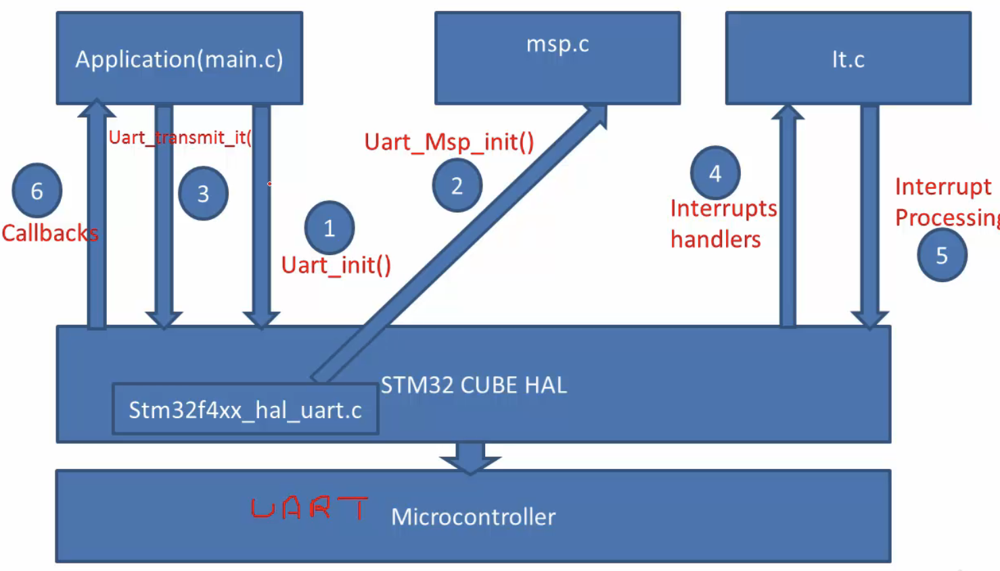

# Create STM32Cube project      
       
Let’s create our first project `01_uart_hello_world` by selecting the `Board Selector` and writing `NUCLEO-F446RE`, click `Next` and on the next window choose `STM32Cube` project at the bottom of the window instead of _Empty_.  
      
- Now it asks, _Initialize all peripherals with their default Mode?_ just click _NO_ here. And it will ask to _open a device configuration perspective_, click _Yes_ here. It may then download the huge package of drivers around 700MB files       
- We are not writing code from scratch as we did in the [repo](https://github.com/noargs/ARM-cortex-m-device-driver-development).       
       
Let's add some code to this project to send a "Hello World" text from our microcontroller board to the computer. You need to connect the board to the computer using the mini USB cable.      
      
        

And when we connect that NUCLEO board to the PC, it creates a virtual COM port on the PC. It's a serial communication port, and you can send messages to this port from PC, and then that message goes to the board, or from the board side you can send message to the computer and that message can be received by using serial port monitoring tools, such as Tera term or Minicom, etc.         

- In this project, we are going to send some messages from board to computer over this serial communication port using the serial communication protocol.      
      
- And at the board side, we are going to use the USART2 interface, because this virtual COM interface actually works on the USART2 peripheral for this board.      
      
- This information is in the user manual of the board, `st website` > `Your board name (NUCLEO-F446RE)` > `Documentations` > `User Manuals` > `UM1724 STM32 Nucleo-64 boards (MB1136)`      

     
      
- Let’s configure this USART2 peripheral in our project. We are in the Device configuration tool as shown below. By using this tool, you can configure any peripherals you want.     

        

For example, let's say, for this project I have to select USART2 peripheral. Then you can go to `Connectivity`, and you can search for that peripheral which is currently disabled, and I can opt for different `Modes` of communication (Asynchronous, Synchronous, Single wire etc).     
- We will select `Asynchronous` communication for this project, that is UART Communication.       
- And then you can configure / select various things related to that peripheral, basically configuration items.    
- You can go to the `Parameter Settings`, you can select the `Baud Rate`. And currently Baud Rate is 115200, the `Word length` is 8 bits, `Parity` none, `Stop Bits` you can select 1 0r 2.      
- I would keep all these Parameter settings as it is.      
- In order to find which pins of this peripheral will be used for _transmit_ and _receive_ purposes. Go to the `GPIO Settings` And you can see, this tool already selected PA2 (USART2_TX) and PA3 (USART2_RX) for this communication.        
     

- That means, **PA2** is a pin through which the microcontroller _emits_ data to the outside world during the serial communication, and **PA3** is a pin through which the microcontroller _receives_ data inside the microcontroller from the external world in the serial communication protocol.      
- These pins should be in _alternate function mode_, because they are being used for special purposes like UART.     
- And all those configurations have already been done by this software, so you don't have to worry about it.    

Even though it is a code generation IDE, we are actually not generating any codes from this IDE. Everything will be understood by going through the datasheet and then we'll be manually coding all these things.      
- So far, We have selected one peripheral that is under `Connectivity`, that is `USART2`. Now, you can generate the code by going to `Project` (top bar of IDE) and click on `Generate code`.       
         

- you will see in the _Core/Src/_`main.c`, it has added codes related to UART and also added the function call to UART_Init (`MX_USART2_UART_Init()`).       
- And if you are wondering where exactly the initialization code is for `MX_USART2_UART_Init()`, here it is in the _Core/Src/_`stm32f4xx_hal_msp.c`       
- All those peripheral initialization code will be in the `_msp.c` (Microcontroller Specific Peripheral MSP file) and `_it.c` (contain Interrupt handlers). Finally `main.c` to write your program logic       

Let's add a code to send a message to the computer over the UART2 peripheral. Hence we will create the `char *msg = "Hello World\n"` on _line 59_. And then scroll down and you will find the USART2 initialisation. After that you can call the transmit function of the UART to send out the message.      
- However we have to check which API to use for that purpose. Since we have selected the UART2 peripheral in the device configuration tool and you had already generated the code. The code generator will add that peripheral specific driver into this folder `Drivers/STM32F4xx_HAL_Driver/Src/stm32f4xx_hal_uart.c`      
- Basically the code generation engine will only include those drivers which are required for this project. It will not unnecessarily include all the Drivers. For example, In this location you will not find any drivers related to Timers, I2C, SPI, or ADC.      
- we will use `HAL_UART_Transmit()` API from this file which was generated by code generator       

```c

/* USER CODE END Header */
/* Includes ------------------------------------------------------------------*/
#include "main.h"
/* Private includes ----------------------------------------------------------*/
/* USER CODE BEGIN Includes */
#include <string.h>
/* USER CODE END Includes */
/* Private typedef -----------------------------------------------------------*/
/* USER CODE BEGIN PTD */
/* USER CODE END PTD */
/* Private define ------------------------------------------------------------*/
/* USER CODE BEGIN PD */
/* USER CODE END PD */
/* Private macro -------------------------------------------------------------*/
/* USER CODE BEGIN PM */
/* USER CODE END PM */
/* Private variables ---------------------------------------------------------*/
UART_HandleTypeDef huart2;
/* USER CODE BEGIN PV */
/* USER CODE END PV */
/* Private function prototypes -----------------------------------------------*/
void SystemClock_Config(void);
static void MX_GPIO_Init(void);
static void MX_USART2_UART_Init(void);
/* USER CODE BEGIN PFP */
/* USER CODE END PFP */
/* Private user code ---------------------------------------------------------*/
/* USER CODE BEGIN 0 */
char *msg = "Hello World\n";
/* USER CODE END 0 */
/**
 * @brief  The application entry point.
 * @retval int
 */
int main(void)
{
 /* USER CODE BEGIN 1 */
 /* USER CODE END 1 */
 /* MCU Configuration--------------------------------------------------------*/
 /* Reset of all peripherals, Initialises the Flash interface and the Systick. */
 HAL_Init();
 /* USER CODE BEGIN Init */
 /* USER CODE END Init */
 /* Configure the system clock */
 SystemClock_Config();
 /* USER CODE BEGIN SysInit */
 /* USER CODE END SysInit */
 /* Initialise all configured peripherals */
 MX_GPIO_Init();
 MX_USART2_UART_Init();
 /* USER CODE BEGIN 2 */
 HAL_UART_Transmit(&huart2, (uint8_t*)msg, strlen(msg), HAL_MAX_DELAY);
 /* USER CODE END 2 */
 /* Infinite loop */
 /* USER CODE BEGIN WHILE */
 while (1)
 {
   /* USER CODE END WHILE */
   /* USER CODE BEGIN 3 */
 }
 /* USER CODE END 3 */
}
```    

- You can download a _Serial port monitor_ software on your PC (i.e. _Tera Term_ for Windows, and _SerialTools_ for MacOSX) to observe the output.         

      

- Make sure to select the following setting as shown below. Baud rate in the Serial port monitor should be 115200 (as the same baud rate was used in our application) and the rest of the settings as follows.                    

     

- Now click `Connect` on the SerialTools and run your application in STM32CubeIDE in `Debug mode` (over SWD in debug configuration) and click `Resume` button on IDE to run the application in one go without Stepping over And you will see the Hello World in the SerialTools terminal      

> [!NOTE]
> We use this device configuration tool just to add the required peripheral driver. We don't configure the peripherals using these configuration boxes. We do that by writing code ourselves (i.e. going to the datesheet, user manual and exploring various things). Hence we will be removing these code generator created files like stm32f4xx_hal_msp.c, stm32f4xx_it.c, and main.c and also main.h, stm32f4xx_it.h (Exclude from build and select Debug, Release as well). We will write all this code from scratch.     

Now, let me create similar files `main_app.c` (to avoid conflict as code generator generates _main.c_), `it.c` and `msp.c` as well as `main_app.h` and `it.h` inside `Core/Src/` and `Core/Inc/`       
- In summary we will use the device configuration tool to add peripheral drivers which will be added in the Drivers folder and we will **ignore** the files stm32f4xx_hal_msp.c, stm32f4xx_it.c, and main.c because we will write it from scratch.     

       

# STM32 HAL and Project Architecture     

we'll be using STM32 HAL DRIVERS APIs (STM32 Cube APIs) in order to work with all these peripherals.         
- Remember that, we will not be auto generating code using CubeMX software which is given by ST that is actually very simple and we will learn very little out of that.      
- We basically use cubeMX software just to create software templates as CubeMX software adds all the required driver files to our project then we will go through the driver files of the peripherals added by the CubeMX software.     
- We will analyse the driver APIs provided by those driver files and then we will use them in our user applications.     

Below figure shows our project architecture. There will be a microcontroller Startup code (**STM32-CUBE Layer** shown below) added by the CubeMX software. It also contains the **CMSIS-CORE** added by the CubeMX software and the HAL driver APIs, which talk to the processor registers via the CMSIS-CORE APIs.      

        

- Our job is to work with different peripherals of the microcontroller, which we will achieve by taking help of driver APIs exposed by the STM32 HAL driver layer.   

        

- The above picture and slide before that, tells us that you cannot call `HAL_UART_Transmit()` inside `main()` straight away without necessary initialisation and which in most cases, gets taken care by the HAL library      

## STM32 Cube Framework Program Flow     

Let's understand the STM32 cube framework program flow.      
      
- As soon as you enter the main() function of the project which is implemented in main.c, the first function to be executed from the main() function has to be HAL_Init() which is used to initialise the device HAL layer or Cube HAL layer of STM32 cube framework. HAL_Init() is implemented in stm32f4xx_hal.c which we will look at later.     

            
      
- The second function which has to be executed from the main() function of the main.c, is SystemClock_Config() which actually configures the system clock of the microcontroller, the calling of SystemClock_Config() is actually mandatory. But when your application has some special requirements like when your application uses USB, SDIO or Ethernet kind of peripherals, then the internal RC oscillator running at 16MHz will not be sufficient to drive those peripherals and you have to switch to other clock sources.        
- Hence you have to derive the clock from using the PLL engine of the microcontroller and SystemClock_Config() will be used for this purpose.      
      
> [!NOTE]    
> Remember SystemClock_Config() is not implemented in the device HAL layer And it has to be implemented by you in main.c. So, that I will cover in the later part of the course.      
      
- You use SystemClock_Config() to switch from internal RC Oscillator (HSI) to the main PLL engine of the microcontroller to generate the system clock for the microcontroller and therefore you can generate 50MHz or 100MHz or you can run the microcontroller at full speed (STM32f446RE can go up to 120MHz or 180MHz). So, all those things you can implement in the SystemClock_Config()        
     
### HAL_Init()       
     
Previously we came to know that the HAL_Init() has to be the first function to be called or in the main() function of the user application that is main.c     
- The HAL_Init() as I said is written by the ST and it is there in the device HAL layer. This function basically does three important things as shown in the diagram below.       

      

- **First** it initialises the flash interface and the configuration is provided by the stm32f4xx_hal_conf.h, that means for every device family, there will be one conf.h, provided by the ST's Cube layer and this conf.h will have all the configuration required to properly initialise the microcontroller.      
- The **Second** thing the HAL_Init() does is very very important, that is SysTick timer initialisation. It initialises the SysTick peripheral of the processor to generate interrupt for one milliseconds (1ms). Hence the background clock will always be ticking in your Cube Mx generated code and generating interrupts. As this is actually a requirement for Cube HAL APIs to work properly, like the APIs to transmit data over UART, SPI, I2C, CAN so almost all data transfer and other APIs depend upon this SysTick timer.      
- The **Third** important thing HAL_Init() does is, it actually calls HAL_MspInit() (MSP stands for Microcontroller Support package) to perform other Processor Specific Low Level Initialisation and this is application specific. That's why HAL_Init() actually calls HAL_MspInit(). Therefore HAL_MspInit() has to be implemented in the application layer and the HAL_Init() will call the function what you have implemented in msp.c          

      

- These INSTRUCTION_CACHE_ENABLE etc macros are defined in the `stm32f4xx_conf.h`. Every family of the microcontroller will have `conf.h`. According to that, this function will configure the flash interface.      
- Second important thing what it does is, it initialises the SysTick timer and uses SysTick as time base source and configures 1ms of Tick. So that is actually carried out       
- Finally it calls the low level hardware HAL_MspInit(), low level hardware means something related to the processor and that's why it calls this function. This function HAL_MspInit() is not implemented in device HAL. It has to be implemented in your user application layer in the msp.c (_Core/Src/_`stm32f4xx_hal_msp.c`) which was generated by Cube Mx.  

    

- You can see in the above picture that the auto generated code has first initialised the priority grouping and this is highly application dependent and after that, it actually sets priority for various exceptions of the system (Cortex-Mx processor), It actually initialises priority of all the system exceptions to zero (that is of highest priority)       
- And you can keep other processors specific initializations over here, like floating point related initializations or sleep mode of the processor etc.     
     
###  main.c, msp.c and it.c    

We saw previously that you cannot use the driver APIs in your code directly as you have to call some functions prior to that     
That we will discuss more on that as we make progress in this course. However let's look at what exactly is the meaning of these three files that are main.c, msp.c and it.c which are present in our application layer in our project.      
- Our main project logic i.e. our main source code should be implemented in main.c and its associated files. If we want to talk to the microcontroller specific peripherals then we will use driver APIs, exposed by STM32 Cube HAL layer, like HAL_UART_transmit(), HAL_UART_recieve() or timer start, timer stop etc. Those are exposed by the respective driver files of the peripheral which is present in the STM32 HAL layer.         

     
     
Let's say we want to communicate with the UART peripheral of the microcontroller. Now, after all the initialisation (HAL_Init(), SystemClock_Config() etc) in the main.c, it causes the UART_Init(), a driver API provided by the UART driver stm32f4xx_hal_uart.c which is present in the STM32 Cube layer.     
- UART_Init() **1** is used to initialise the peripheral as before using any peripheral, you have to first initialise that.            

     
     
- Now, there are actually two initialisations. One is called high level initialisation (usually in main.c) related to the peripheral and another one is low level initialisation. For example, setting up of UART baud rate is a high level initialization, whereas enabling and setting up the priority for the UART IRQ number will be the lower level initialization of the peripheral.        
- Next, the cube layer calls back HAL_UART_MspInit() **2** function which must be implemented in msp.c (Core/Src/stm32f4xx_hal_msp.c) to accomplish the low level initialisation.       
- So, collectively step number **1** and step number **2** completes the initialisation of a peripheral.     
- After that the application transmits the data using HAL_UART_Transmit_IT() **3** (implemented in Drivers/STM32F4xx_HAL_Driver/Src/stm32f4xx_hal_uart.c generated by Cube Mx) that is UART transmit with interrupt in order to transmit some data over the UART peripheral to the external world.     
- Now, once the data is transmitted successfully then the peripheral issues interrupt **4** to the processor.
Hence your interrupt handler written in the `it.c` will run. An interrupt handler has to decide what kind of interrupt it is or what causes the interrupt. For example, in this scenario, why the UART peripheral issued an interrupt, whether it was due to completion of transmission, reception or whether it is due to some error. Therefore the interrupt has to be decoded and that will be done by checking the status of the UART status register. Hence we have to process that interrupt **5**.       
- That's why the interrupt handler which is written in it.c will call Interrupt Processing API in STM32 HAL layer.    

     
     
- And the interrupt processing code which is there in the STM32 device HAL, will then call the appropriate callback back to the main.c **6**. And there are different types of callbacks. For example, in the case of the UART peripheral. It could be transmission complete callback or reception complete callback or it could be error callback. Alternatively if it is a timer peripheral then it could be a period elapsed callback. if it is a DMA peripheral then it could be a full transfer complete callback, half transfer complete callback, DMA error callback etc. If it is an RTC peripheral then the callback may be an alarm callback or timestamp callback etc.      
- So, each and every peripheral will have set up callbacks, now which will be identified properly by the STM32 device layer. And it will call the appropriate callback back to the main.c where you have to take the appropriate decision.     
      
If you go and check in the STM32CubeIDE project all these 3 files are already there. So, we will delete these 3 files and we will write our own. Now, we are going to understand what exactly is happening between the application and the cube HAL. And then we will examine all the provisions given by the cube HAL.      


             

     


