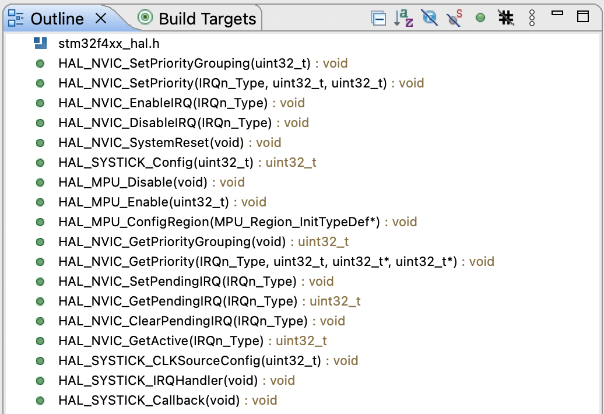

# Peripheral handle structure      
      
     

- Just like Spade you need a Handle to work with it efficiently and save time and energy, Similarly HAL provides various handle structures to handle different peripherals efficiently.     

Remember, every peripheral will come with its own handle structure. And before working with that peripheral you have to create a structure variable.     
      
     

- Picture above shows an example of a UART handle structure which contains various member elements.     
- But remember that the member elements of a handle structure will be different for different peripherals.     
- For example, the communication peripherals like UART, SPI, I2C, CAN they have one kind of member elements and non-communicational peripherals like ADC, timers they may have different member elements in the handle structures. Hence member elements of a handle structure won't be the same across multiple peripherals.     
- However, in most of the Handle structure, the first two member elements will be almost the same (as highlighted below).      
      
       

- These two member elements are really really important. First member element is an Instance of a peripheral and that is of type XXX_TypeDef means you can replace XXX by any peripherals like UART, ADC, RTC etc. XXX_TypeDef member element is used to hold the peripheral register base address       
- And the Second member element is InitTypeDef which is used to hold the peripheral configurable parameters. Because, every peripheral will have its own configurable parameters. For example, the configurable parameters for the UART peripheral will be The baud rate, the number of data bits, the number of stop bits, parity control, hardware flow control etc.       
      
         
     
- And now let's understand exactly what the need of this structure is. Let's go back to our spade example. And you can see that, in order to handle this instrument (Spade) as I said you need to handle but where does that handle and spade meet. They meet at one junction where the handle is attached to the spade. Then only you can work with that instrument properly. Similarly, huart2 is just a variable like any other C variable and you attach a variable to the peripheral by means of the base address of the peripheral in interest. So, by initialising the handle structure with a base address of the peripheral, you actually attach that handle structure variable to the UART peripheral.      

      

you will find handle structure for almost all the peripherals except few like GPIO and RCC peripheral as they don’t need handle structures.       

       
       
      
 You can find Device specific header file in the following directory     

       
        
     
We will link the variable haurt2 associated with handler structure and peripheral (in our case UART) and we know that linking happens because of *Instance variable and we have to initialise this with the peripheral register base address       
      
       
       
      
      
       

# Understanding STM32 HAL program flow with UART exercise        

              

### Understanding        
     
Let's code this exercise, in order to see how to develop an application in the Cube HAL framework. Create a new CubeMX project 02_uart_example and give F446RE in the Board Selector tab and click NO to initialise all the peripherals and click Finish. In the CubeMX GUI pick USART2 and select mode to Asynchronous and then Generate code by going to top MaxOSX bar Project > Generate Code. We only want templates. We are not going to generate any configuration by using this software.       
- Delete main.c (hold User application), msp.c (hold peripheral initialisation) and it.c (hold interrupt handlers) in Core/Src directory and delete main.h and it.h in Core/Inc directory and create new files with the same names as we want to start from a clean slate.      
- First we will include stm32f4xx_hal.h in the main.c and the very first call from the main function has to be HAL_Init(). Second function should be SystemClockConfig() and it's not defined in the Cube HAL layer as it is application specific and you have to define it in your application. We will keep its implementation empty as you should use it only when you need special clock settings. However by default, the MCU will be running with the internal RC oscillator. Hence we need not to use SystemClockConfig(). Below is the code of main.c file       

```c
#include "stm32f4xx_hal.h"
#include "main.h"
int main(void)
{
 HAL_Init();
 SystemClockConfig();
 return 0;
}
void SystemClockConfig(void)
{
}
```           
     
And now the next step is low level hardware initialisations. As we called HAL_Init() in the main() to initialise the HAL layer (STM32Cube HAL layer) and if you go through HAL_Init() API, you can see that at the end, it calls HAL_MspInit() to do the low level hardware initialisation (processor specific). Remember, these steps are purely optional steps and it depends on the application.

      
      
- Hence all these low level hardware initialisations we can put under HAL_MspInit().      
If you go to the HAL_MspInit() function defined in stm32f4xx_hal.c you can see that this is attributed as weak. And there you can see the note which says that this function should not be modified when the a callback is needed. The HAL_MspInit() could be implemented in the user file.     

        
      
We will implement this function in the msp.c and here we do processor specific inits.     

```c
void HAL_MspInit(void)
{
 // Here we will do low level processor specific inits.
 //1. Set up the priority grouping of the ARM Cortex MX processor

 //2. Enable the required System exceptions of the ARM Cortex MX processor

 //3. Configure the priority for the System exceptions
}           
```      
      
     
### 1. Set up priority grouping     

This file consists of lots of API to play with the processor specific peripherals like SysTick, NVIC, MPU etc.     

            

If we take an example of NVIC priority based APIs in order to configure the priority, to enable a particular IRQ or disable and so on. And pick the first API HAL_NVIC_SetPriorityGrouping(uint32_t) and read its documentation.     

       

Here you can see this API sets the priority grouping field and priority of a Cortex-Mx processor has two parts, preemption priority and another one is called subpriority.     
- The **preemption priority** decides which interrupt should be allowed to run on the processor. when two or more interrupts are pending. And whichever has got the lower preemption priority (number) will be activated or will be allowed to run on the processor first.      
- If for example, two interrupts of the same preemption priority are pending, then the processor checks their **subpriority**. Similarly an interrupt, which has got the lesser subpriority value will be allowed first, when two interrupts of the same preemption priority are pending.      
      
Now, in this particular microcontroller, you can achieve five different types of priority grouping, that is from priority group 0 to priority group 4 (NVIC_PRIORITYGROUP_0 to NVIC_PRIORITYGROUP_4). **By default, if you don't configure this priority grouping then remember that the NVIC_PRIORITYGROUP_4 will be active**.      

       

`NVIC_PRIORITYGROUP_4` has **4** bits for preemption priority and 0 bits for subpriority and this is the default configuration. And as for your application needs, if you want to change the priority grouping then you can use one among these arguments (`NVIC_PRIORITYGROUP_0` to `NVIC_PRIORITYGROUP_3`) to configure the priority grouping.      
      
However in our project we will be using priority grouping 4 in the `msp.c` file.        

#include "stm32f4xx_hal.h"

```c
void HAL_MspInit(void)
{
 // Here we will do low level processor specific inits.
 //1. Set up the priority grouping of the ARM Cortex MX processor
 HAL_NVIC_SetPriorityGrouping(NVIC_PRIORITYGROUP_4);

 //2. Enable the required System exceptions of the ARM Cortex MX processor

 //3. Configure the priority for the System exceptions
}          
```     
     
- **NVIC_PRIORITYGROUP_4** in `HAL_NVIC_SetPriorityGrouping(NVIC_PRIORITYGROUP_4);` is redundant as this is the default priority grouping.      
     
### 2. Enable System exceptions     

Now, the next step is to _enable the required system exceptions of the ARM Cortex-Mx processor_. There are lots of system exceptions like Hard fault, Bus fault, Usage fault, SVC, PendSV etc. You can read more in Cortex-Mx

Processors Generic User Guide (GUG Page: 239 `Cortex-M4 Peripherals` > `4.3 System control block` > `4.3.9 System Handler Control and State Register`). Now, depending on your application, you can enable or disable any of the system exceptions.      
- **Hard fault will be active by default**.       
- Lets enable MemManage, BusFault, and UsageFault system exceptions through our code. And to enable these system exceptions you have to configure something in the processor specific details.  That's where the _System control block_ (SCB).      
- System control block is a collection of registers which control the various system level activities of the Cortex-Mx processor. And under System control block, you can go to _System handler control and State register (SHCSR)_ and here you will see various fields to enable the System exceptions.          

        

You cannot enable all the exceptions by using this register (as shown above). For SysTick and PendSV, you have to refer to some other registers.     

```c

#include "stm32f4xx_hal.h"


void HAL_MspInit(void)
{
 // Here we will do low level processor specific inits.
 //1. Set up the priority grouping of the ARM Cortex MX processor
 HAL_NVIC_SetPriorityGrouping(NVIC_PRIORITYGROUP_4);

 //2. Enable the required System exceptions of the ARM Cortex MX processor
 SCB->SHCSR |= 0x7 << 16; // enable usage fault, mem fault and bus fault exception
 
//3. Configure the priority for the System exceptions

}
```      

To turn on Memory Fault you have to make MemFault Enable register to 1. Similarly for Bus Fault Enable and Usage Fault Enable register to 1.     

### 3. Configure priority for System exception           

Next step is to configure the priority for the system exceptions and **this is also optional step because the priority will be 0 by default** (that is the highest priority)     
- Hence you need not to configure any priority unless you want to change those settings. But for your record we will see now how to change the priority of a system exception.     
- You have to go to `stm32f4xx_hal_cortex.c` and refer to the API details for **HAL_NVIC_SetPriority**(IRQn, PreemptPriority, SubPri)      
      
- First argument is the IRQn_Type and clicking it will take you to its definition in the device specific header file. You will see a big enum definition. Upper part is _Cortex-M4 processor exceptions_ numbers and bottom part is _interrupt numbers_ of the microcontroller       

      

- Second and Third arguments are for Preempt and Subpriority as we don't have any Sub priority as we have selected priority grouping 4 **NVIC_PRIORITYGROUP_4** that means 0 sub priority and 4 bits of Preempt priority. That's why, we will not be having sub priority in our case.      
- if you just go through the API documentation of  . You will see the second argument Preempt priority is actually the preemption priority value for the IRQn channel. This parameter can be valued between 0 and 15, where 0 is considered as the highest priority and 15 is considered as the lowest priority. Similar is the case of SubPriority       

       

```c
#include "stm32f4xx_hal.h"
void HAL_MspInit(void)
{
 // Here we will do low level processor specific inits.
 //1. Set up the priority grouping of the ARM Cortex MX processor
 HAL_NVIC_SetPriorityGrouping(NVIC_PRIORITYGROUP_4);

 //2. Enable the required System exceptions of the ARM Cortex MX processor
 SCB->SHCSR |= 0x7 << 16; // enable usage fault, mem fault and bus fault exception

 //3. Configure the priority for the System exceptions
 HAL_NVIC_SetPriority(MemoryManagement_IRQn, 0, 0);
 HAL_NVIC_SetPriority(BusFault_IRQn, 0, 0);
 HAL_NVIC_SetPriority(UsageFault_IRQn, 0, 0);
}
```             
      
- Similarly, you can assign priorities for SVCall, Debug monitor System exception, PendSV etc.    
- You don't need to do anything for SysTick as the priority settings and enabling of SysTick interrupts is already taken care of by the HAL_Init() API which is the very first thing in the main() function.      

       


##  Peripheral Initialisation (High Level and Low level)                   
      
        

There are two kinds of peripheral initialisations. One is high level initialisations and the second one is low level initializations. First we will do High-Level initialization and then Low level.     

      

### High level initialisation (of peripheral)      

High level initialisations means the parameter initialisation. For example, in our application the parameters are UART parameters like baud rate, number of Stop bits, data bits, hardware flow control settings etc.     
     
- First we do the High-Level Peripheral initialisation (i.e. UART2_Init(void)).             

```c
#include "stm32f4xx_hal.h"
#include "main.h"


void SystemClockConfig(void);
void UART2_Init(void);
void Error_handler(void);


UART_HandleTypeDef huart2;


int main(void)
{
 HAL_Init();
 SystemClockConfig();
 UART2_Init();
 return 0;
}
void SystemClockConfig(void) { }
void UART2_Init(void)
{
 huart2.Instance = USART2;
 huart2.Init.BaudRate = 115200;
 huart2.Init.WordLength = UART_WORDLENGTH_8B;
 huart2.Init.StopBits = UART_STOPBITS_1;
 huart2.Init.Parity = UART_PARITY_NONE;
 huart2.Init.HwFlowCtl = UART_HWCONTROL_NONE;
 huart2.Init.Mode = UART_MODE_TX_RX;
 if (HAL_UART_Init(&huart2) != HAL_OK)
 {
         // There's a problem
         Error_handler();
 }
}
void Error_handler(void)
{
        // Trap here or blink any LED's to indicate error
        while(1);
}
```        

- Instance and Init variables are as described previously and also shown in picture below.    

         

Possible values of Init’s member element (struct type UART_InitTypeDef) like BaudRate, WordLength StopBit can be taken from stm32f4xx_hal_uart.h file by searching the @ref i.e. UART_<member_element_name>     

                            
       

### Low level initialisations (of peripheral)      

      

When you look into the HAL_UART_Init() implementation (can be found in `stm32f4xx_hal_uart.h`) you will see it is in turn calling `HAL_UART_MspInit(huart)` **2** (implemented by us in the `msp.c` file) according to the workflow we saw previously as shown below.     

      

`HAL_UART_MspInit(huart)` is attributed as weak in the `stm32f4xx_hal_uart.h` file, which means you have to define it in your code `msp.c` file (in User application)      

             

```c

void HAL_UART_MspInit(UART_HandleTypeDef *huart)
{
  // here we do the low level `peripheral` specific inits
  //1. enable the clock for the USART2 peripheral
  //2. do the pin muxing configuration
  //3. enable the IRQ and set up the priority (NVIC settings)
}
```      

        

### 1. Enable the clock for USART2 peripheral     

```c

void HAL_UART_MspInit(UART_HandleTypeDef *huart)
{
        // here we do the low level `peripheral` specific inits
        //1. enable the clock for the USART2 and GPIO peripheral
        __HAL_RCC_USART2_CLK_ENABLE();
        __HAL_RCC_GPIO_CLK_ENABLE();
        //2. do the pin muxing configuration
        //3. enable the IRQ and set up the priority (NVIC settings)
}
```           

### 2. Pin muxing configuration    

      
     

- USART peripheral needs at least 2 pins, TX and RX. And if there is any hardware flow control then it would need another 2 pins, that is RTS and CTS. But since we are not using hardware flow control, we only need two pins.     
- We can bring TX and RX functionalities up on various pins of the microcontroller. It is not just limited to two pins. And let's identify all those pins over which the USART2 peripheral is able to communicate.       

     

Go to to the datasheet of STM32F44RE under `4 Pinout and pin description` > `Table 11 Alternate function`        

                                  

    
                    


         

