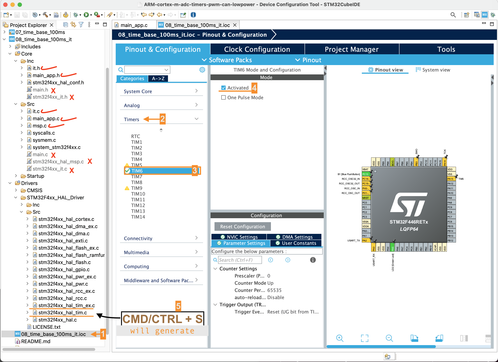

## Exercise (Timer in Interrupt mode)     
     
Previously, we did the time base generation using _polling mode_. Now we try the same thing using **Interrupt mode**.    
    
In the previous application, there is no way the processor can go to sleep as the processor will always be polling for the `TIM_SR_UIF` flag in the status register as follows `while( !(TIM6->SR & TIM_SR_UIF))`.    
    
Hence, for the low power applications, where you want to save some power, the polling method is not really useful. Therefore it is better to implement this logic using the interrupts.				
		 
Exclude following files from build `main.c`, `main.h`, `stm32f4xx_it.c`, `stm32f4xx_hal_msp.c` as well as `stm32f4xx_it.h` and instead use `main_app.c`, `main_app.h`, `it.c`, and `msp.c` names. As CubeMx auto name the files as `main.c`, `main.h`, `stm32f4xx_it.c`, `stm32f4xx_hal_msp.c` and `stm32f4xx_it.h` during **code generation process**     
     
> We use CubeMx to generate **Driver's Layer** only. We are not using rest of auto generated code and files and rather done things from scratch.   
     
Basic timer **TIM6** is _activated_ from CubeMx (08_time_base_100ms_it.ioc) to generate driver's layer `Drivers/STM32F4xx_HAL_Driver/stm32f4xx_hal_tim.c` and `Drivers/STM32F4xx_HAL_Driver/stm32f4xx_hal_tim_ex.c`		
     
 	
    
		 
		 
		 
      		    		 