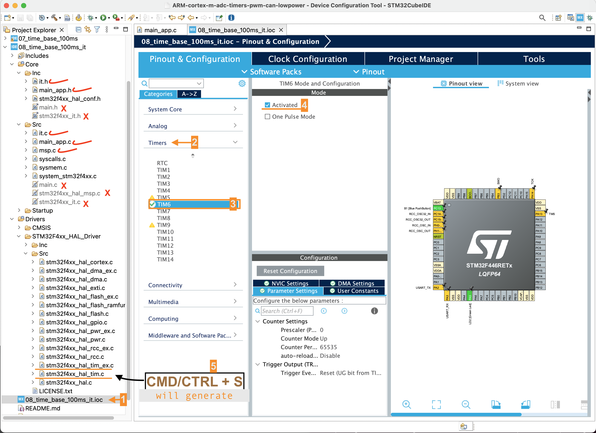

## Exercise (Timer in Interrupt mode)     
     
Previously, we did the time base generation using _polling mode_. Now we try the same thing using **Interrupt mode**.    
    
In the previous application, there is no way the processor can go to sleep as the processor will always be polling for the `TIM_SR_UIF` flag in the status register as follows `while( !(TIM6->SR & TIM_SR_UIF))`.    
    
Hence, for the low power applications, where you want to save some power, the polling method is not really useful. Therefore it is better to implement this logic using the interrupts.				
		 
Exclude following files from build `main.c`, `main.h`, `stm32f4xx_it.c`, `stm32f4xx_hal_msp.c` as well as `stm32f4xx_it.h` and instead use `main_app.c`, `main_app.h`, `it.c`, and `msp.c` names. As CubeMx auto name the files as `main.c`, `main.h`, `stm32f4xx_it.c`, `stm32f4xx_hal_msp.c` and `stm32f4xx_it.h` during **code generation process**     
     
> We use CubeMx to generate **Driver's Layer** only. We are not using rest of auto generated code and files and rather done things from scratch.   
     
Basic timer **TIM6** is _activated_ from CubeMx (`08_time_base_100ms_it.ioc`) to generate driver's layer `Drivers/STM32F4xx_HAL_Driver/stm32f4xx_hal_tim.c` and `Drivers/STM32F4xx_HAL_Driver/stm32f4xx_hal_tim_ex.c`		
     
 	  
     
We start the timer using Interrupt mode API `HAL_TIM_Base_Start_IT(&htimer6);`. And when the interrupt occurs, it will run the IRQ Handler and we have to take the IRQ Handler name `TIM6_DAC_IRQHandler` from startup file `startup_stm32f446retx.s` and implement it in the `it.c`    
      
As previously described, it doesn't matter which peripheral interrupt handler function you write, However, inside that you have to first call the interrupt processing API (In the case of TIMER, the Interrupt processing API is `HAL_TIM_IRQHandler(htim))`. As in the case of UART we had seen that already. Similarly for timer you have to use that interrupt processing API.     

Interrupt processing API then check why exactly the interrupt occured, Whether it was due to update event, input capture event, output compare event or so. And then it calls the respective callbacks i.e. `HAL_TIM_IC_CaptureCallback(htim)`, `PWM_PulseFinishedCallback(htim)` etc.     
      
As it is a basic timer in our case. Hence, there is no question of input capture and output compare etc. (Basic TIMERs don't have those capabilities). Therefore interrupt is triggered due to the update event. if you browse through the code it will check timer update event (by analysing the timer flag update, `TIM_FLAG_UPDATE`).

```c
  /* TIM Update event */
  if (__HAL_TIM_GET_FLAG(htim, TIM_FLAG_UPDATE) != RESET)
  {
    if (__HAL_TIM_GET_IT_SOURCE(htim, TIM_IT_UPDATE) != RESET)
    {
      __HAL_TIM_CLEAR_IT(htim, TIM_IT_UPDATE);
#if (USE_HAL_TIM_REGISTER_CALLBACKS == 1)
      htim->PeriodElapsedCallback(htim);
#else
      HAL_TIM_PeriodElapsedCallback(htim);
#endif /* USE_HAL_TIM_REGISTER_CALLBACKS */
```     
     
`TIM_FLAG_UPDATE` flag is nothing but the timer's status registers UIF flag (`TIM_SR_UIF` in `stm32f4xx_hal_tim.h`) and then it calls `PeriodElapsedCallback(htim)` as name indicates that the period has been elapsed. Hence, this callback should be implemented in your `main.c` and `__weak` attribute should be removed.    
      
```c
void HAL_TIM_PeriodElapsedCallback(TIM_HandleTypeDef *htim)
{
  HAL_GPIO_TogglePin(GPIOA, GPIO_PIN_5);
}
```      
    
		 
		 
		 
      		    		 