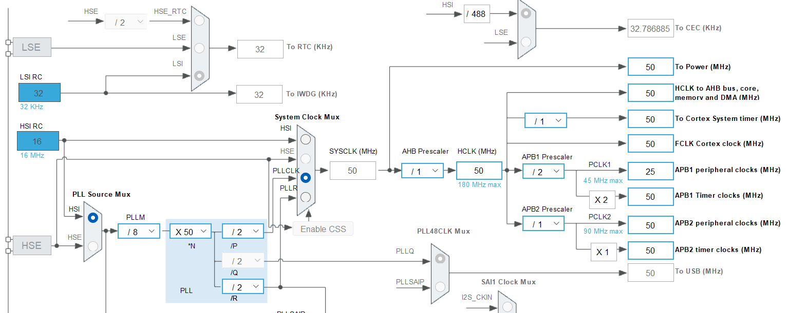

To create a project follow the previous (`08_time_base_100ms_it`) repo's [README](https://github.com/noargs/ARM-cortex-m-adc-timers-pwm-can-lowpower/tree/main/08_time_base_100ms_it), enable TIMER6 and generate code and also create `main_app.c`, `msp.c`, and `it.c` _Core/Src_ directory And create `main_app.h` and `it.h` in _Core/Inc_ directory.     
      
Exclude following files from build:
- `main.c`, `stm32f4xx_hal_msp.c`, and `stm32f4xx_it.c` in _Core/Src_ directory.
- `main.h`, `stm32f4xx_it.h` in _Core/Inc_ directory.       

In this exercise, which is based on timebase generation using timer6 (i.e. TIM6) peripheral of the microcontroller.    
      
|:-------------|:-------------|
| TIMER Clock Frequency (TIMx_CLK) | 50000000 (50MHz) |
| Prescaler | 9 |
| TIMER Count Clock (CNT_CLK) | 5000000 |
| Time Peroid of CNT_CLK | 0.0000002 |
| Period Value (ARR) | 50 |
| Timebase required | 0.00001 |        
     
We use the timer clock frequency as 50MHz `SYS_CLOCK_FREQ_50_MHZ` and if we analyse that using diagram below, our system clock **SYSCLK** will running at 50MHz and **AHB prescaler** will be 1, **HCLK** will be 50, our processor **Cortex System timer** will be running at 50MHz and the **HCLK to the AHB bus** will be 50MHz. However you look at the timer **APB1 Timer clocks** will also get 50MHz. Even though the **APB1 prescaler** is 2 here. Hence the **APB1 peripheral clock** will be 25MHz, which is actually under-driven as it's maximum capacity is 45 MHz. On the other hand, the timer clock frequency **APB1 Timer clocks** will be 50MHz. Therefore the timebase required is 10 micro (as mentioned on above table as **0.00001**). Similarly, we get the ARR value 50, if we use the prescaler 9. However if we use prescaler 19, then you would get ARR (Period value) as 25.      
     
     

```c
void TIMER6_Init(void)
{
  htimer6.Instance = TIM6;
  htimer6.Init.Prescaler = 9;
  htimer6.Init.Period = 50-1;
  if (HAL_TIM_Base_Init(&htimer6) != HAL_OK)
  {
	Error_handler();
  }
}
```          
     
Now build/run the project on the target chip (NUCLEO-F446RE),      
     
> [!NOTE]     
> After building the project If you dont see the binary, simply right click on the project and click _Refresh_     
     
Now analyse the program with _logic analyser_. The capture is completed and it is showing 9.75 microseconds. So, we are actually short of 0.2 microseconds. This may be due to the error involved in this software and we are actually getting close to the 10 microseconds.      
       
> [!NOTE]      
> Toggling GPIOs(`HAL_GPIO_Togglepin()`) using softwares, whenever update event happens, is not that recommended. As a timer peripheral can do that automatically without using any code, for that we have to use OUTPUT COMPARE feature of the timer which is available in General Purpose timer.     
      
```c
void HAL_TIM_PeriodElapsedCallback(TIM_HandleTypeDef *htim)
{
  HAL_GPIO_TogglePin(GPIOA, GPIO_PIN_5);
}
```        
     
Using code to toggle the GPIO actually involves lots of code execution and it consumes lots of clock cycles or bus cycles. Hence, you will never get accurate timings.     
     
This exercise was introduced to work with timer clock with different clock frequencies (`TIMx_CLK`). You can give different timebase (other than 10ms) and play with these numbers and try to get the trace and analyze it. Alternatively, you can find out what is the maximum/minimum delay. The maximum delay means the ARR value has to be all 0xFF that is around 65K. However for the minimum, you may have some restrictions, as in interrupt mode the interrupt processing routine itself takes around 3 microseconds.      
      
You can find out that by going to `it.c` and toggle a GPIO before and after `HAL_TIM_IRQHandler(&timer6)` (make the GPIO high before `HAL_TIM_IRQHandler(&timer6)` and after  and find out the gap between those 2 transitions. Which will give you the amount of time required to process this function. That is the bottleneck.