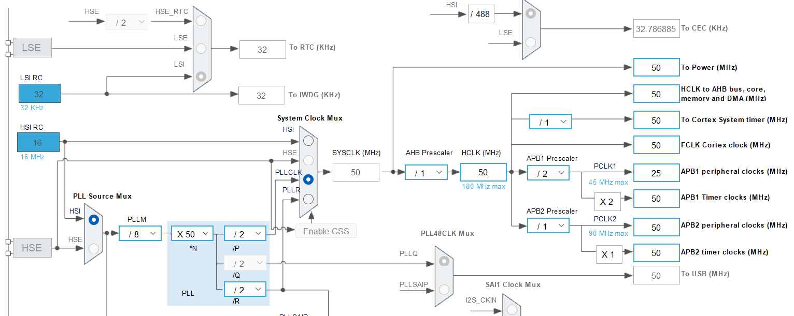

# Intro     
    
- The Controller Area Network Protocol was originally developed during the late 1980's by the German company Robert Bosch for the automotive industry.     
- It is a multi-master serial communication bus, which basic design specification called for high speed, high noise-immunity and error detection features.     
- CAN offers data communication up to 1 Mbit/sec.      
- The Error Confinement and the Error Detection features make it more reliable in noise-critical environments in the automotive industries.       


CAN protocol was developed as there was a need to communicate with various devices of an automobile. For example, There were many control units in the car i.e. Air conditioning system, Engine system, Braking system and various sensors etc. Hence, to communicate with all those units. They were looking for a reliable, accurate, robust communication method. It definitely couldn't be Bluetooth or WiFi based communication to control various devices. As  an automobile is a dynamic system and it is a noisy environment. For example if you use let's say zigbee for this communication, then you may not be able to achieve good quality of service as you may lose some packets. Now Control area network protocol is actually governed by [ISO specifications](https://www.iso.org/standard/63648.html).        

## CAN's most attractive features       

- Low cost, Reliability, Extreme robustness, High data transmission speed (up to 1 MBit/sec).       
- Excellent error handling and Error Confinement abilities.      
- Automatic re-transmission of faulty messages.     
- Automatic bus disconnection of nodes that are suspected to be physically faulty.     
- Functional addressing - data messages do not contain source or destination addresses, only identifiers relating to their function and/or priority.       

The CAN protocol (the CAN controller along with CAN signalling and the CAN physical layer) is actually a low cost solution.       
The CAN is designed to work under various dynamic conditions of the automobiles. Where the ambient noise source is actually pretty high. CAN and its signalling is designed in such a way that it is immune to ambient noises of the application area because of differential signalling.       

We will understand in upcoming section as how to configure the CAN data rate to work under 500 Kbps, 125 Kbps or you can even reach up to 1 MBit/sec and all are actually based on the clock speed by which you run the CAN controller. The CAN specification comes with error detection and error handling.       
The CAN specification suggests Auto bus off (Automatic disconnection of faulty nodes).       
In Functional addressing, when a CAN node transmits a message. It is heard by all the nodes on the CAN network. There is no address specific to the node as in the case of I2C. Hence in CAN there's no addressing. On the other hand an identifier is used to distinguish between the different messages and also the identifier is used to resolve the priority.       

## CAN summary     

      

> [!NOTE]      
> **It's a broadcast type of Bus** - Unlike a traditional network such as USB or Ethernet, or I<sup>2</sup>C. CAN does not send data point-to-point from node A to node B under the supervision of a central bus master.       

## Understanding CAN and its parts        

In this section we expore what exactly is the node (as show below).       
        

Now, the node arrangement will be something like below.     

       

We have a microcontroller which contains a CAN controller or CAN peripheral. This CAN controller gives you 2 single ended pins (digital pins) to communicate, **CAN TX** and **CAN RX**.        
Now according to the CAN specification, You cannot use these digital signals to communicate with another node. That is not allowed.      
The specification of the CAN protocol has a dedicated section, where it explains about the physical medium used for the communication.       
Instead, we use differential signals which your microcontroller does not produce.      

As these digital signals are good for very short range communication. However, CAN is introduced for automobiles, where we have to cover larger distances like 1 metre to 40 metres (in the automation industry) and so on. In such cases, you cannot use these digital signals to send or receive data.      
The differential signals give more immunity to the noise and data can be transmitted reliably. Hence there is a need to convert these _single ended signals_ to _differential signals_.       

To achieve the _differential signals_, you need a transceiver, a **CAN transceiver**. It actually takes single-ended signals and converts them into differential signals, **CANH** (CAN High) and **CANL** (CAN Low). Hence, MCU's CAN Controller and CAN Transceiver is called a Node.     

       

A CAN bus will have two lines, CANH line and CANL line and both lines are terminated by a **Termination resistor** (RL). If you want to attach your Node to the bus. You just have to connect CANH terminal of your Node to the CANH line of the Bus and CANL terminal of your Node to the CANL line of the Bus (as shown below).      

        

## Single Ended Vs Differential signals      
     
In this section, we understand the CANH and CANL signals; these are the differential signals produced by the CAN transceiver. Now, differential signalling is a method of data communication, which uses two complementary signals.   
You can learn more about differential signalling using this [wiki page](https://en.wikipedia.org/wiki/Differential_signaling).      

The picture below is a _Single ended_ data communication. Where a line goes high and the receiver interprets that as the logical 1 state. And when the signal goes down, i.e. grounded (0 voltage) the receiver interprets that as logical zero. That's how data communication takes place in a Single ended communication.            
      
      

The picture below shows _Differential signals_, Two complementary voltage signals to transmit one information.     
For example, to send logical 1 signal, 1 becomes, let's say +5 volt and signal 2 becomes complementary to that (-5 volt) and the receiver considers the difference between these two signals' voltage levels. And that happens to be +10 volt. Which is ultimately considered as logic 1 by the receiver.                    
      
      

When the noise is added to the signalling it will get added equally to the signal. Hence the receiver takes the difference and the noise cancelling will happen automatically and that is the biggest advantage of the differential signalling.       

And as I said the receiver extracts the information by detecting the potential difference between inverter and the non inverter signals. And to send logical zero, signal 1 becomes -5 volt and signal 2 becomes +5 volt. And the difference is now -10 volts. And that is considered as logical 0 by the receiver.       
      
> [!NOTE]      
> Differential signals are not only used by CAN but also by USB, RS485, RS235 and in many application areas as the physical medium.        

In summary, a _Single ended_ signals communication logical zero means 0 volt. Logical 1 means let's say 5 or 3.3 volt. However, in differential signalling logical 0 means let's say -10 volt And logical one means +10 volt.                   

## Understanding CAN Differential signals           
     
As we saw earlier, the transceiver produces differential signals CAN High and CAN Low. And remember, these are complementary signals (CANL is actually a complementary signal of CANH).           

            

Let's understand with an example (as shown in the above picture). You want to transmit _logical 1_. What does the transceiver do? It will make the CAN High signal as 2.5 volt (can be any) and CAN Low will also be 2.5 volt. So the difference will be 0 volt. Hence the logical 1 will also be called as a **Recessive state** of the CAN bus. If you want to transmit, Let's say _logic 0_. CAN High will be at 3.5 volt or whatever the voltage you apply to the transceiver (you assume +VCC) and CAN Low will be approximately near 70% of the VCC (i.e. 1.5 volt). So, the difference is approximately 2 volts. Moreover, this stage of the CAN High is called the **Dominant state** (CAN state will be dominant. If you want to transmit logic 0 remember)             

       

Lets go to the [datasheet](https://www.ti.com/lit/ds/symlink/sn65hvd233-ht.pdf) of the transceiver; TIs SN65xx CAN transceiver (SN65HVD233-HT 3.3-V CAN Transceiver)      

     

We also have a functional diagram of the transceiver.     

              

CANH and CANL differential signals are shown above which are the outputs and the input is D (driver) and R (receiver)     
     
Picture below shows the **Transmitter block**          

              

Picture below shows the **Receiver block**       

         

CANL is produced by negating the output of CANH as shown below (There is Not symbol). That means CANL will be complimentary to CANH.      

              

And you can also see the CANH and CANL signals are then looped back to the engine (circled below) and that's, How the reception takes place            
               

That also means whatever you transmit is also sensed by the receiver engine of the transceiver (will be looped back to the receiver block). Hence if D is equal to 1 then CANH and CANL will go to Recessive state.                 
              

And if D is equal to 0 then, CANH and CANL will go to the Dominant state (as shown below)      
      
            
Let's browse through the _Reference Manual_ of TIs SN65HVD233 CAN Transceiver. There are lots of details which you can go through at your own pace however i would like to take you to the table **7.5 Driver Electrical Characteristics** page:8 and look into the first row. Bus output voltage (dominant) as we see when D is equal to 0. CANH will be VCC and CANL (CAN Low) will not be equal to -VCC. But 1.25 volts or slightly less.        
          

Suppose, if you supply VCC as 3.3 volt to this transceiver. Then 3.3 - 1.25 = 2.05 volts which is roughly 2 volts (CANL will be 2.05 volts). This is the dominant state.         
        
And bus output voltage recessive means, you have to supply D = 1. So, D = 1 is considered as 3 volts. Hence CANH will be 2.3 volt and CANL also will be a 2.3 volt. So, the differences will be 0 volt.          
            

According to the datasheet, if we apply 3.3 volt to the transceiver, then recessive (logic 1 or D = 1) CAN Hi and CAN Lo will be 2.3 volts. Whereas in dominant (logic 0 or D = 0) CAN Hi will be 3.3 volts and CAN Lo will be 1.25 volts (as shown below)                 
        
          
> [!IMPORTANT]     
> Remember, Don’t give the transceiver more than 3.3 volt.         

      

The meaning of dominant should be in reference to something else (as dominant over what?). So, dominant over the recessive state . So logical 0 is always dominant over logical 1. Because logical 1 always results in a recessive state of the bus and logical 0 always results in the dominant state of the bus.       
       
Truth table shown below to understand the recessive and dominant logic        
          

Let's assume at time **T1**, Node A and Node B try to put a _dominant_ bit simultaneously. The resultant bus state will become dominant.      
At time **T2**, Node A tries to put a _recessive_ bit and Node B _dominant_ bit. The resultant bus state will become _dominant_ (Node B will dominate). As we have seen previously, whatever Node A will transmit it will also sense it back, when Node A put recessive bit and sensed back dominant bit (because of _NOT_ inverted logic) it will understand that someone is dominating the bus. Hence Node A will back off from accessing the bus and will try after sometime.      
That's how the bus access will get serialised. Node A will wait until the bus becomes idle. That means Node A will keep sensing the bus and when it finds 6 or 7 (not sure about this number we will see later) recessive states continuously.      
       
At time **T3**, a Node A tries to put a dominant bit and Node B tries to put a recessive bit simultaneously. This time Node A will get dominated. Because the bus state will be dominant in this case. Hence Node B will backoff and it will try after some time when it finds the bus is idle        
At time **T4**, when Node A and B try to put a recessive bit. Then the bus state will become recessive. That's how the serialisation of bus access happens       
       
For a reminder, the dominant state of the bus is voltage difference of 2 volts. And happens when you try to send logical 0. Whereas the recessive state is where the potential difference between CAN Hi and CAN Lo is 0 volt and this state happens when you try to send a logical 1.        
         
           
## CAN signalling summary          

           

# CAN Message Types    

- There are 4 different message types (or frames) in CAN protocol.           
                                  

Let's understand CAN message types. There are 4 different message types, frames or frame types available in the CAN protocol (as shown above)       
We will often use **Data frame** and **Remote frame** in our applications. Whereas **Error frame** and **Overload frame** are actually used by the controllers automatically whenever they detect any violation.                                     


To create a project follow the previous (`08_time_base_100ms_it`) repo's [README](https://github.com/noargs/ARM-cortex-m-adc-timers-pwm-can-lowpower/tree/main/08_time_base_100ms_it), enable TIMER6 and generate code and also create `main_app.c`, `msp.c`, and `it.c` in _Core/Src_ directory And create `main_app.h` and `it.h` in _Core/Inc_ directory.     
      
Exclude following files from build:
- `main.c`, `stm32f4xx_hal_msp.c`, and `stm32f4xx_it.c` in _Core/Src_ directory.
- `main.h`, `stm32f4xx_it.h` in _Core/Inc_ directory.       

In this exercise, which is based on timebase generation using timer6 (i.e. TIM6) peripheral of the microcontroller.     

|              |              |    
|:-------------|-------------:|     
| TIMER Clock Frequency (TIMx_CLK) | 50000000 (50MHz) |   
| Prescaler | 9 |   
| TIMER Count Clock (CNT_CLK) | 5000000 |    
| Time Peroid of CNT_CLK | 0.0000002 |   
| Period Value (ARR) | 50 |      
| Timebase required | 0.00001 |        
     
We use the timer clock frequency as 50MHz `SYS_CLOCK_FREQ_50_MHZ` and if we analyse that using diagram below, our system clock **SYSCLK** will running at 50MHz and **AHB prescaler** will be 1, **HCLK** will be 50, our processor **Cortex System timer** will be running at 50MHz and the **HCLK to the AHB bus** will be 50MHz. However you look at the timer **APB1 Timer clocks** will also get 50MHz. Even though the **APB1 prescaler** is 2 here. Hence the **APB1 peripheral clock** will be 25MHz, which is actually under-driven as it's maximum capacity is 45 MHz. On the other hand, the timer clock frequency **APB1 Timer clocks** will be 50MHz. Therefore the timebase required is 10 micro (as mentioned on above table as **0.00001**). Similarly, we get the ARR value 50, if we use the prescaler 9. However if we use prescaler 19, then you would get ARR (Period value) as 25.      
     
     

```c
void TIMER6_Init(void)
{
  htimer6.Instance = TIM6;
  htimer6.Init.Prescaler = 9;
  htimer6.Init.Period = 50-1;
  if (HAL_TIM_Base_Init(&htimer6) != HAL_OK)
  {
	Error_handler();
  }
}
```          
     
Now build/run the project on the target chip (NUCLEO-F446RE),      
     
> [!NOTE]     
> After building the project If you dont see the binary, simply right click on the project and click _Refresh_     
     
Now analyse the program with _logic analyser_. The capture is completed and it is showing 9.75 microseconds. So, we are actually short of 0.2 microseconds. This may be due to the error involved in this software and we are actually getting close to the 10 microseconds.      
       
> [!NOTE]      
> Toggling GPIOs(`HAL_GPIO_Togglepin()`) using softwares, whenever update event happens, is not that recommended. As a timer peripheral can do that automatically without using any code, for that we have to use OUTPUT COMPARE feature of the timer which is available in General Purpose timer.     
      
```c
void HAL_TIM_PeriodElapsedCallback(TIM_HandleTypeDef *htim)
{
  HAL_GPIO_TogglePin(GPIOA, GPIO_PIN_5);
}
```        
     
Using code to toggle the GPIO actually involves lots of code execution and it consumes lots of clock cycles or bus cycles. Hence, you will never get accurate timings.     
     
This exercise was introduced to work with timer clock with different clock frequencies (`TIMx_CLK`). You can give different timebase (other than 10ms) and play with these numbers and try to get the trace and analyze it. Alternatively, you can find out what is the maximum/minimum delay. The maximum delay means the ARR value has to be all 0xFF that is around 65K. However for the minimum, you may have some restrictions, as in interrupt mode the interrupt processing routine itself takes around 3 microseconds.      
      
You can find out that by going to `it.c` and toggle a GPIO before and after `HAL_TIM_IRQHandler(&timer6)` (make the GPIO high before `HAL_TIM_IRQHandler(&timer6)` and after  and find out the gap between those 2 transitions. Which will give you the amount of time required to process this function. That is the bottleneck.