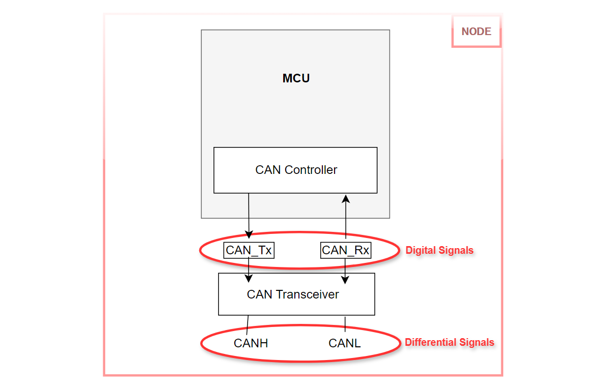
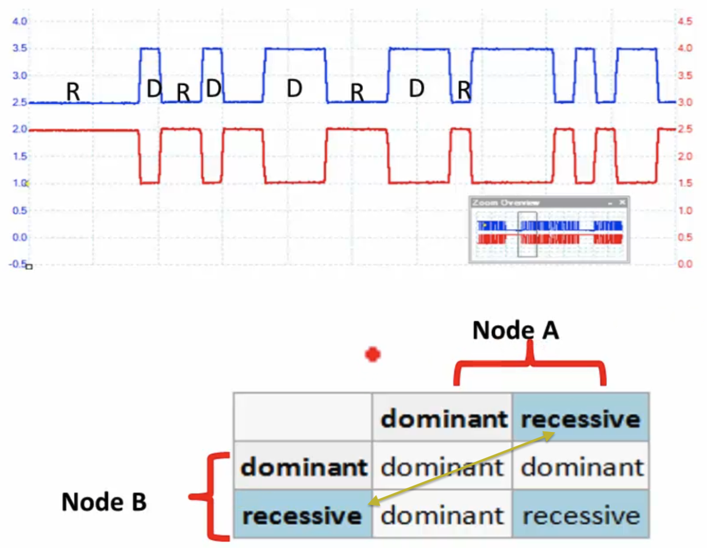

# Intro     
    
- The Controller Area Network Protocol was originally developed during the late 1980's by the German company Robert Bosch for the automotive industry.     
- It is a multi-master serial communication bus, which basic design specification called for high speed, high noise-immunity and error detection features.     
- CAN offers data communication up to 1 Mbit/sec.      
- The Error Confinement and the Error Detection features make it more reliable in noise-critical environments in the automotive industries.       

CAN protocol was developed as there was a need to communicate with various devices of an automobile. For example, There were many control units in the car i.e. Air conditioning system, Engine system, Braking system and various sensors etc. Hence, to communicate with all those units. They were looking for a reliable, accurate, robust communication method. It definitely couldn't be Bluetooth or WiFi based communication to control various devices. As  an automobile is a dynamic system and it is a noisy environment. For example if you use let's say zigbee for this communication, then you may not be able to achieve good quality of service as you may lose some packets. Now Control area network protocol is actually governed by [ISO specifications](https://www.iso.org/standard/63648.html).        

## CAN's most attractive features       

- Low cost, Reliability, Extreme robustness, High data transmission speed (up to 1 MBit/sec).       
- Excellent error handling and Error Confinement abilities.      
- Automatic re-transmission of faulty messages.     
- Automatic bus disconnection of nodes that are suspected to be physically faulty.     
- Functional addressing - data messages do not contain source or destination addresses, only identifiers relating to their function and/or priority.       

The CAN protocol (the CAN controller along with CAN signalling and the CAN physical layer) is actually a low cost solution.       
The CAN is designed to work under various dynamic conditions of the automobiles. Where the ambient noise source is actually pretty high. CAN and its signalling is designed in such a way that it is immune to ambient noises of the application area because of differential signalling.       

We will understand in upcoming section as how to configure the CAN data rate to work under 500 Kbps, 125 Kbps or you can even reach up to 1 MBit/sec and all are actually based on the clock speed by which you run the CAN controller. The CAN specification comes with error detection and error handling.       
The CAN specification suggests Auto bus off (Automatic disconnection of faulty nodes).       
In Functional addressing, when a CAN node transmits a message. It is heard by all the nodes on the CAN network. There is no address specific to the node as in the case of I2C. Hence in CAN there's no addressing. On the other hand an identifier is used to distinguish between the different messages and also the identifier is used to resolve the priority.       

## CAN summary     

      

> [!NOTE]      
> **It's a broadcast type of Bus** - Unlike a traditional network such as USB or Ethernet, or I2C. CAN does not send data point-to-point from node A to node B under the supervision of a central bus master.       

## Understanding CAN and its parts        

In this section we expore what exactly is the node (as show below).       
        

Now, the node arrangement will be something like below.     

       

We have a microcontroller which contains a CAN controller or CAN peripheral. This CAN controller gives you 2 single ended pins (digital pins) to communicate, **CAN TX** and **CAN RX**.        
Now according to the CAN specification, You cannot use these digital signals to communicate with another node. That is not allowed.      
The specification of the CAN protocol has a dedicated section, where it explains about the physical medium used for the communication.       
Instead, we use differential signals which your microcontroller does not produce.      

As these digital signals are good for very short range communication. However, CAN is introduced for automobiles, where we have to cover larger distances like 1 metre to 40 metres (in the automation industry) and so on. In such cases, you cannot use these digital signals to send or receive data.      
The differential signals give more immunity to the noise and data can be transmitted reliably. Hence there is a need to convert these _single ended signals_ to _differential signals_.       

To achieve the _differential signals_, you need a transceiver, a **CAN transceiver**. It actually takes single-ended signals and converts them into differential signals, **CANH** (CAN High) and **CANL** (CAN Low). Hence, MCU's CAN Controller and CAN Transceiver is called a Node.     

       

A CAN bus will have two lines, CANH line and CANL line and both lines are terminated by a **Termination resistor** (RL). If you want to attach your Node to the bus. You just have to connect CANH terminal of your Node to the CANH line of the Bus and CANL terminal of your Node to the CANL line of the Bus (as shown below).      

        

## Single Ended Vs Differential signals      
     
In this section, we understand the CANH and CANL signals; these are the differential signals produced by the CAN transceiver. Now, differential signalling is a method of data communication, which uses two complementary signals.   
You can learn more about differential signalling using this [wiki page](https://en.wikipedia.org/wiki/Differential_signaling).      

The picture below is a _Single ended_ data communication. Where a line goes high and the receiver interprets that as the logical 1 state. And when the signal goes down, i.e. grounded (0 voltage) the receiver interprets that as logical zero. That's how data communication takes place in a Single ended communication.            
      
      

The picture below shows _Differential signals_, Two complementary voltage signals to transmit one information.     
For example, to send logical 1 signal, 1 becomes, let's say +5 volt and signal 2 becomes complementary to that (-5 volt) and the receiver considers the difference between these two signals' voltage levels. And that happens to be +10 volt. Which is ultimately considered as logic 1 by the receiver.                    
      
      

When the noise is added to the signalling it will get added equally to the signal. Hence the receiver takes the difference and the noise cancelling will happen automatically and that is the biggest advantage of the differential signalling.       

And as I said the receiver extracts the information by detecting the potential difference between inverter and the non inverter signals. And to send logical zero, signal 1 becomes -5 volt and signal 2 becomes +5 volt. And the difference is now -10 volts. And that is considered as logical 0 by the receiver.       
      
> [!NOTE]      
> Differential signals are not only used by CAN but also by USB, RS485, RS235 and in many application areas as the physical medium.        

In summary, a _Single ended_ signals communication logical zero means 0 volt. Logical 1 means let's say 5 or 3.3 volt. However, in differential signalling logical 0 means let's say -10 volt And logical one means +10 volt.                   

## Understanding CAN Differential signals           
     
As we saw earlier, the transceiver produces differential signals CAN High and CAN Low. And remember, these are complementary signals (CANL is actually a complementary signal of CANH).           

            

Let's understand with an example (as shown in the above picture). You want to transmit _logical 1_. What does the transceiver do? It will make the CAN High signal as 2.5 volt (can be any) and CAN Low will also be 2.5 volt. So the difference will be 0 volt. Hence the logical 1 will also be called as a **Recessive state** of the CAN bus. If you want to transmit, Let's say _logic 0_. CAN High will be at 3.5 volt or whatever the voltage you apply to the transceiver (you assume +VCC) and CAN Low will be approximately near 70% of the VCC (i.e. 1.5 volt). So, the difference is approximately 2 volts. Moreover, this stage of the CAN High is called the **Dominant state** (CAN state will be dominant. If you want to transmit logic 0 remember)             

       

Lets go to the [datasheet](https://www.ti.com/lit/ds/symlink/sn65hvd233-ht.pdf) of the transceiver; TIs SN65xx CAN transceiver (SN65HVD233-HT 3.3-V CAN Transceiver)      

     

We also have a functional diagram of the transceiver.     

              

CANH and CANL differential signals are shown above which are the outputs and the input is D (driver) and R (receiver)     
     
Picture below shows the **Transmitter block**          

              

Picture below shows the **Receiver block**       

         

CANL is produced by negating the output of CANH as shown below (There is Not symbol). That means CANL will be complimentary to CANH.      

              

And you can also see the CANH and CANL signals are then looped back to the engine (circled below) and that's, How the reception takes place            
               

That also means whatever you transmit is also sensed by the receiver engine of the transceiver (will be looped back to the receiver block). Hence if D is equal to 1 then CANH and CANL will go to Recessive state.                 
              

And if D is equal to 0 then, CANH and CANL will go to the Dominant state (as shown below)      
      
            
Let's browse through the _Reference Manual_ of TIs SN65HVD233 CAN Transceiver. There are lots of details which you can go through at your own pace however i would like to take you to the table **7.5 Driver Electrical Characteristics** page:8 and look into the first row. Bus output voltage (dominant) as we see when D is equal to 0. CANH will be VCC and CANL (CAN Low) will not be equal to -VCC. But 1.25 volts or slightly less.        
          

Suppose, if you supply VCC as 3.3 volt to this transceiver. Then 3.3 - 1.25 = 2.05 volts which is roughly 2 volts (CANL will be 2.05 volts). This is the dominant state.         
        
And bus output voltage recessive means, you have to supply D = 1. So, D = 1 is considered as 3 volts. Hence CANH will be 2.3 volt and CANL also will be a 2.3 volt. So, the differences will be 0 volt.          
            

According to the datasheet, if we apply 3.3 volt to the transceiver, then recessive (logic 1 or D = 1) CAN Hi and CAN Lo will be 2.3 volts. Whereas in dominant (logic 0 or D = 0) CAN Hi will be 3.3 volts and CAN Lo will be 1.25 volts (as shown below)                 
        
          
> [!IMPORTANT]     
> Remember, Don’t give the transceiver more than 3.3 volt.         

      

The meaning of dominant should be in reference to something else (as dominant over what?). So, dominant over the recessive state . So logical 0 is always dominant over logical 1. Because logical 1 always results in a recessive state of the bus and logical 0 always results in the dominant state of the bus.       
       
Truth table shown below to understand the recessive and dominant logic        
          

Let's assume at time **T1**, Node A and Node B try to put a _dominant_ bit simultaneously. The resultant bus state will become dominant.      
At time **T2**, Node A tries to put a _recessive_ bit and Node B _dominant_ bit. The resultant bus state will become _dominant_ (Node B will dominate). As we have seen previously, whatever Node A will transmit it will also sense it back, when Node A put recessive bit and sensed back dominant bit (because of _NOT_ inverted logic) it will understand that someone is dominating the bus. Hence Node A will back off from accessing the bus and will try after sometime.      
That's how the bus access will get serialised. Node A will wait until the bus becomes idle. That means Node A will keep sensing the bus and when it finds 6 or 7 (not sure about this number we will see later) recessive states continuously.      
       
At time **T3**, a Node A tries to put a dominant bit and Node B tries to put a recessive bit simultaneously. This time Node A will get dominated. Because the bus state will be dominant in this case. Hence Node B will backoff and it will try after some time when it finds the bus is idle        
At time **T4**, when Node A and B try to put a recessive bit. Then the bus state will become recessive. That's how the serialisation of bus access happens       
       
For a reminder, the dominant state of the bus is voltage difference of 2 volts. And happens when you try to send logical 0. Whereas the recessive state is where the potential difference between CAN Hi and CAN Lo is 0 volt and this state happens when you try to send a logical 1.        
         
           
## CAN signalling summary          

           

# CAN Message Types    

- There are 4 different message types (or frames) in CAN protocol.           
                                  

Let's understand CAN message types. There are 4 different message types, frames or frame types available in the CAN protocol (as shown above)       
We will often use **Data frame** and **Remote frame** in our applications. Whereas **Error frame** and **Overload frame** are actually used by the controllers automatically whenever they detect any erros or violations of signaling rules in the CAN protocol. However, we basically use Data frame more frequently than the Remote frame.      
      
### Data Frame      

- One of the Most Common Message Types in CAN communication.       
- We use it very frequently in our application.        
- This is a frame format used by a CAN Node to send a message to other Nodes (It's like to broadcast a message which uses data frame.)         
      
### Data Frame format           

In every digital communication or in any specification you find the frame has many fields like payload field, length field, the CRC field, the field which marks the beginning and end of the frame etc. Similarly, CAN protocol also has various segments / fields in a Data frame.       
The important fields are the **Start of Frame** first dominant bit which marks the start of a frame. Next, we have **Arbitration field** which consumes 12 bits. Next, some Control fields (**IDE**, **Reserverd**), followed by length field **Data Length Code (DLC)**. And after comes the **Data** field, where we put our payload (8-bytes maximum). Next is the **CRC** field which you need not to calculate and put any CRC code here as the controller has the capability to calculate the CRC automatically and append to the frame. And after that, comes an important field, that is the **Ack slot bit** and this Ack slot is actually set to dominant by the receiving Node (if it finds that the frame is good).      
Hence, if a transmitter finds a dominant state at Ack slot bit position, then transmitter concludes that message sent successfully and If a transmitter sees recessive state at this position, then it understands that message has an error. Therefore it automatically re-transmits the message. _Ack slot is actually managed by the receiving node_.     
        
         
        
Now, after that follows the **End of frame**. End of frame is actually a collection of 7 recessive states and then comes 3 bit **Inter Frame Spacing** (IFS0-IFS2 are another 3 recessive states).       
      
We will understand each important field one by one.      
      
### Arbitration Field      
       
Arbitration fields actually contains an Arbitration ID. In which, 11 bit is called as an identifier. And there is another bit that is called as **RTR** bit (Remote Transmission Request). So the Arbitration ID follows _Start of Frame_ bit. That is the first dominant bit.        
       
- The arbitration field determines the priority of the message when two or more nodes are contending for the bus. The Arbitration field contains: For _CAN 2.0A_ specification, an 11-bit identifier and one bit for RTR bit, which is dominant for Data frame.       
- This 11-bit Arbitraion identifier establishes the priority of the message. The lower the binary value, the higher its priority.        
       
> [!NOTE]        
> According to **CAN 2.0**, If Arbitration identifier contains 11-bits in a frame then it is called as **Standard CAN** frame. On the other hand, if its 29-bits identifier then its called **Extended CAN**.      

### Standard CAN Vs Extended CAN     

- The original specification is the Bosch specification Version 2.0.        
- Version 2.0 specification is divided into two parts. **Standard CAN (Version 2.0A) uses 11 bit identifier**. whereas **Extended CAN (Version 2.0B) uses 29 bit identifier** (made up of 18-bit extension and an 11-bit identifier)              
- Most **2.0A** controllers transmit / receive only Standard format messages.        
- Whereas **2.0B** controllers can send and receive messages in both formats.       

They have added two more control bits, **SRR** and **IDE** to distinguish Standard frame and Extended frame.                    
       
       

For example, our microcontroller, which is STM32 based microcontroller, comprises of a CAN controller with 2.0B specification. Therefore it is Extended CAN controller or BX CAN (Basic Extended CAN). For this, you have to check the data sheet or the reference manual of your microcontroller to understand the kind of CAN controller it contains.      
      
- If you have a CAN network which consist of both 2.0A and 2.0B based CAN devices and if you use extended frame format (29 bit identifier) for data communication. Then your network will not work as 2.0A devices will not understand those identifiers and they will start generating an error.       
- 2.0B controllers are completely backward compatible with 2.0A controllers and can transmit / receive messages in either format.       
- Whereas 2.0A controller based devices are capable of transmitting / receiving messages in 2.0A format only (Standard format). With this type of controller, reception of any 2.0B message will flag an error.          
         
### RTR bit (Remote Transmission Request)         

For Data frame you need not to worry about this as if you mention a frame type as a Data frame. Then your controller will automatically make this bit as dominant.      
The _dominant RTR bit_ (logic 0) indicates that the message is Data frame. A _recessive_ value (logic 1) indicates that the message is a Remote Transmission Request or also known as Remote frame. A Remote Frame is a request by one Node for data from some other node on the bus. Hence, **Remote Frames do not contain a Data Field**.    
      
### DLC, DATA, and CRC Fields     

The 4-bit data length code (DLC) constains the number of bytes of data being transmitted.    

The Data Field, which contains 0 to 8 bytes of data.         

The CRC Field contains a 15 bit checksum calculated on most parts of the message. This checksum is used for error detection.      
      
### ACK      
     
As soon as CAN receiver starts receiving a frame it also calculates the CRC and then it matches with the CRC send by the transmitter. If a frame doesn't violate any CAN specification rules then the receiver makes the bus state as dominant at Ack slot bit and when transmitter sees that slot as dominant. It understands that message has transmitted successfully. On the other hand, if transmitters sees recessive it will re-transmit the message as that is Nack. Therefore ACK slot in debugging is very helpful.      
       
> [!NOTE]      
> It is worth noting that the presence of an Acknowledgment Bit on the bus does not mean that any of the intended devices has received the message.      
> It just means that one or more nodes on the bus has received it correctly and Transmitter concludes that message sent successfully.     
> If Transmitter sees recessives state at the ACK slot, then it re-transmits the message until it sees dominant state. That's the reason when there is only one node on the bus, transmitter keep sending the same message since no one is there to ACK it. Hence the ACK bit is actually set by the receiving node. It is not set by the transmitting node. So, transmitter will always keep this slot as recessive only. But someone has to override this bit with dominant bit If that node has received that properly.       
      
### ACK Significance Summary     

- Every Node receiving an accurate message overwrites this recessive bit in the original message with a dominate bit, indicating an error-free message has been sent. If a receiving node detects an error then it leaves this bit as recessive, it discards the message and the sending Node repeats the message after the re-arbitration. So in this way, each Node acknowledges(ACK) the integrity of its data. ACK is 2 bits, one is the acknowledgment bit and one is the ACK delimiter.        
- Bbecause all receivers must participate in the acknowledgement algorithm regardless of whether the message is intended for them or not, an acknowledgment to the transmitter may occur even if the expected receiver is not present on the network (There must be one node on the network as It need not be an intended node).       
- This means that the CAN ACK does not guarantee that a data transfer has occurred between the transmitter and a designated receiver. It does not confirm that a requested action has been understood or performed. CAN ACK only confirms that all resident network Nodes agree that the CAN message did not violate any Data Link layer rules.     

### End of Frame, IFS (Inter Frame Spacing), and SOF (Start of frame)      

After the ACK field comes the End of Frame. The **End of Frame** is actually a collection of _7 recessive_ states. And after that comes the **IFS** which stands for Inter Frame Spacing. That is actually the collection of _3 recessives_ States. Hence, collectively 10 recessive states before the Bus becomes Idle. It means, if a node is waiting to transmit it has to find Idle bus. So, when it listens all these recessive states. It actually concludes that bus is Idle.    

         
      
> [!NOTE]       
> 10 recessive states (EOF + IFS) forms tail of a CAN frame, after this only a Node which is listening to the bus understands that bus is idle. Therefore any dominant bit head after IFS is considered as SOF (Start of Frame)      

SOF - The signle dominant start of frame (SOF) bit marks the start of a message, and is used to synchronize the node on a bus after being idle            

       

### Remote Frame     
     
The Remote frame is used to send requests to some other Node, to ask for data / some information.     
     
- The intended purpose of the remote frame is to solicit the transmission of data from another node.      
       
- The remote frame is similar to the data frame, with the two important differences. First, this type of message is explicitly marked as a remote frame by a recessive RTR bit in the arbitration field and secondly, there is no data as this is just a request.      
      
Let's have an example,   
- If say, Node A transmits a remote frame with the Arbitration field set to 123. Then Node B, if properly initialized, might respond with a Data Frame with the Arbitration Field also set to 123.      
- Remote frames can be used to implement request and response type communication between Nodes.      
- Most CAN controllers can be programmed to automatically respond to Remote Frame.     
- **In the Remote Frame, RTR Bit is recessive And there is no data.**           
              

## Bus access from Multiple Nodes            
      
The CAN communication protocol is a carrier-sense, multiple-access protocol with collision detection and arbitration on message priority (CSMA/CD+AMP). AMP stands for Arbitration on message priority.       
      
CSMA means that each node on a bus must wait for a prescribed period of inactivity before attempting to send a message (That inactivity is sensed because of the continuous recessive states like End of Frame and IFS). CD+AMP means that collisions are resolved through the bit-wise arbitration, based on a preprogramed priority of each message in the identifier field of a message.       
      
The higher priority identifier always wins the bus access.      
      
### Bitwise Bus Arbitration      

let's consider three nodes here, NODE-1, NODE-2 and NODE-3 and have there Arbitration IDs (11-bit identifiers) as shown below.      
       
         
     
If all these Nodes try to access the CAN bus at the same time, NODE 3 is going to win the bus arbitration, because it has the lowest 11 bit identifier (`0x659`) as lower the arbitration ID number, higher is the priority.   
     
As shown below in the diagram we have 3 Nodes, and Bus state. All 3 Nodes are trying to send a message at the same time as they find that the Bus is idle. Every frame start with the a dominat bit (SOF). After that they all put the first bit (MSB) of the arbitration ID which happens to be 1, 1, 1 for all three nodes. After that the Bus state  becomes recessive because all 3 Nodes have put recessive bit. Again they put 1 1 1 and state will remain recessive. Next, they all put 0 0 0 twice which is dominant state. Hence the bus state becomes dominant. Next they put recessive bits 1 1 1. Next at 5th bit NODE-2 looses arbitration.      

          
       
As NODE-2 was trying to put the recessive bit whereas NODE-1 and NODE-3 were putting dominant bit. Therefore NODE-2 goes out of arbitration as the bus state became dominant. 
          
          
          
As you Remember, in CAN transceiver, whatever a Node puts on the bus, it also hears it back. So, NODE-2 actually put the recessive state (means the potential differences between CANH and CANL is zero). However it hears back the potential difference of two. And it understands that it lost the arbitration. So, that's why it will just go to the Listen Only mode. It will not try to compete with NODE-1 and NODE-3.    
       
Now the arbitration continues between NODE-1 and NODE-3 until 2nd bit where Node-1 is trying to put the recessive bit  NODE-3 put the dominant bit. Therefore NODE-3 wins the arbitration and NODE-1 loses. Consequently NODE-1 goes to listen only mode.          
             

After that there are no more devices, so NODE-3 continues to put its remaining bits of the identifier field and finally the RTR and after that it sends the Data. Thats how a node which has the lowest identifier value wins the bus arbitration. That also means that an identifier consisting entirely of zeroes is the highest priority message on a network, because it hold the bus dominant the longest.
        
> [!NOTE]     
> A dominant bit always overrides recessive bit on a CAN bus and the allocation of message priority is up to you (up to the application writer). However all these arbitration will happen automatically by the controller itself. You just have to allocate the priority values.

# STM32 bxCAN intro      

In reference manual go to **30 Controller area netwrok (bxCAN)** _page: 1046_ section. It gives you full details on the bxCAN peripheral of the STM32 microcontroller. As How to handle the transmission? How to handle the reception? What are the interrupts triggered by the bxCAN? and what are the features available like acceptance filtering etc.   
     
### ST's bxCAN controller      

The bxCAN (Basic extended CAN) module handles the transmission and reception of CAN messages fully autonomously. Standard identifiers (11-bit) and extended identifiers (29-bit) are fully supported by the hardware.         
     
### ST's bxCAN features      
      
- This microcontroller (NUCLEO-F446RE) has got 2 CAN controllers available CAN1 and CAN2.     
- CAN1 is called Master bxCAN and all the other CAN controllers are called as slave. Hence, CAN2 is a slave.     
- Both, CAN1 and CAN2, supports CAN protocol version 2.0A and 2.0B (You can use this peripheral in a Standard CAN network also and Extended CAN network).       
- You can achieve bit rates up to 1 Mbps (This depends on your clock period and other clock related details).      
- Three transmit mailboxes are available to transmit CAN messages (mailboxes means there is a transmit mailbox hardware, which can hold one CAN message at one time. As we have Three transmit mailboxes. Hence you can put three CAN messages into three transmit mailboxes and you can trigger the transmission).      
- Now, the each peripheral has got 2 receive FIFOs with three stages.        
- And 28 filter banks which are shared between CAN1 and CAN2.       
      
### What application can do with bxCAN?

- If you are an application developer,  you can configure CAN parameters like the _bit rate_, _bit timings_, etc.    
- You can trigger the transmissions.         
- You can handle the receptions (where you get an interrupt and you go to the CAN ISR, read the FIFO. However all the receptions, filtering and moving data to the FIFO, everything is taken care of by the hardware)     
- You can manage interrupts (Whenever transmission, receptions is completed, alternatively when error occurs). You just have to manage those ISRs.     
- And finally, get some diagnostic information of the CAN Bus.      

### bxCAN block diagram     

Refer to RM: Figure 384, Dual CAN block diagram at page: 1048             

This is a dual CAN block diagram. As this microcontroller has dual CAN means it has 2 CAN controllers. One is CAN1 (Master) and other is CAN2 (Slave).       
       
> [!NOTE]      
> It feels quite misleading terminologies used in terms of CAN. When you hear master and slave because you already know that, CAN is not a master and slave based communication. As CAN is multi master communication. However, in CubeMX software or in the reference manual, it says CAN1 master and CAN2 peripheral as slave. Because of the features available in those CAN controllers. As in the case of ST, CAN2 has no direct access to the SRAM memory. And some of the features if you want to enable in CAN2, you have to take the help of CAN1. So, that's why CAN1 is called as master (If you want to use CAN2 peripheral then you have to enable CAN1 peripheral first). But in terms of implementation of CAN specification, CAN1 and CAN2 are same. Both are 2.0 A B specification based controllers.       
       
For example, In the reference manual it is mentioned that CAN1 is master bxCAN, for managing the communication between slave bxCAN and the 512 bytes of SRAM memory. So, CAN2 is a slave bxCAN with no direct access to the SRAM memory.    
      
As you can see on above diagram, both CAN has got their own transmit mailboxes. For example Master has got **three mailboxes** which is used to transmit a CAN message. You just have to put a CAN message in one of these mailboxes or you can put three Tx messages into these three mailboxes and utlimately trigger the transmission. Similarly, slave has also got three mailboxes.      
      
Now, master has got 2 receive **FIFOs**, FIFO 0 and FIFO 1 same as slave has also got FIFO0 and FIFO1. It has got space for three CAN messages and If the fourth one comes then there will be an over run. However you can see, in between, There is something called **acceptance filtering** which as its name indicates, filters the CAN message based on your rules. And these acceptance filters have 28 filter banks. Each filter bank has two filters. However, these acceptance filters are shared between master and slave. Therefore if slave wants to use that then you have to enable the master.      
     
On the left handside of the diagram shows, all the **Control, Status, Configuration** registers like Master control, Master status, Tx status, Rx FIFO 0 Status register etc.     
     
Apart from Specification 2.0 A B implementation which is mandatory implementation, ST has given its own design in their microcontroller which includes, three Tx mailboxes, receive FIFOs, acceptance filtering and also there you will find one transmission scheduler (that is required as when you keep all the messages in the mailboxes and when you trigger the transmission then transmission schedular have to check, which message has got higher priority, ultimately schedule that message first. Finally, the CAN controller should participate in the arbitration and if arbitration wins, then the CAN controller is going to transmit that message.        
         
## bxCAN Test modes          
      
The bxCAN peripheral of the STs microcontroller, comes with three test mode, **Silent Mode**, **Loop back Mode** and **Silent+ Loop Back Mode**. This is basically to test your CAN controller before you introduce that into the CAN network.     

       
     
### Silent mode     

- CAN_Tx is separated from the Tx and CAN_Tx line is internally looped back to Rx line    
- CAN Tx is held at recessive state (always maintained at logical 1)     
- bxCAN is able to receive valid frames      
- It just listens and doesn't change the bus state by putting dominant bit.      
- Can be used as a sniffer which just analyses the traffic on the bus      

### Loop Back mode     
     
- bxCAN can transmit frames on the bus.    
- Also the frames are looped back to the Rx line internally.     
- bxCAN will not listen to the bus, but just receives its own message which is looped back.     
- loop back mode is provided for self test functions       

### Silent Loop Back mode     

- bxCAN controller is totally disconnected from the bus.    
- It neither transmits nor listens to the bus
- Tx is internally looped back to the Rx, hence receives its own messages.        

   

