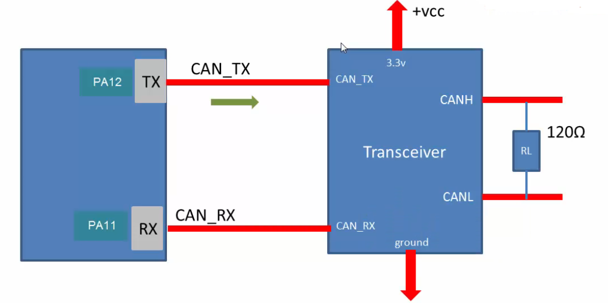

Create a CubeMx project and go to **Connectivity** > **CAN1** and click checkbox _Activated_. You will see CAN1_TX and CAN1_RX pin PA12 and PA11. These are a single ended digital signals and these pins should go to the transceiver. Below that we have _Configuration_ section where we do _Parameter Settings_, _NVIC Settings etc_. We need not to do anything here as we will do in code. Neither you need to do anything in the _Clock configuration_ Tab. Now _Generate the code_.   
      
Similar to other projects we will use our own files in Src and Inc folder (i.e. `main_app.c`, `msp.c`, `it.c`, `main_app.h`, and `it.h`). We will use HSE as a System clock Not HSI.      
      
One of the member of CAN Handle structure `CAN_HandleTypeDef` is `Init` which is type `CAN_InitTypeDef` and contains following members.     

```c
typedef struct
{
  uint32_t Prescaler;                  /*!< Specifies the length of a time quantum.
                                            This parameter must be a number between Min_Data = 1 and Max_Data = 1024. */

  uint32_t Mode;                       /*!< Specifies the CAN operating mode.
                                            This parameter can be a value of @ref CAN_operating_mode */

  uint32_t SyncJumpWidth;              /*!< Specifies the maximum number of time quanta the CAN hardware
                                            is allowed to lengthen or shorten a bit to perform resynchronization.
                                            This parameter can be a value of @ref CAN_synchronisation_jump_width */

  uint32_t TimeSeg1;                   /*!< Specifies the number of time quanta in Bit Segment 1.
                                            This parameter can be a value of @ref CAN_time_quantum_in_bit_segment_1 */

  uint32_t TimeSeg2;                   /*!< Specifies the number of time quanta in Bit Segment 2.
                                            This parameter can be a value of @ref CAN_time_quantum_in_bit_segment_2 */

  FunctionalState TimeTriggeredMode;   /*!< Enable or disable the time triggered communication mode.
                                            This parameter can be set to ENABLE or DISABLE. */

  FunctionalState AutoBusOff;          /*!< Enable or disable the automatic bus-off management.
                                            This parameter can be set to ENABLE or DISABLE. */

  FunctionalState AutoWakeUp;          /*!< Enable or disable the automatic wake-up mode.
                                            This parameter can be set to ENABLE or DISABLE. */

  FunctionalState AutoRetransmission;  /*!< Enable or disable the non-automatic retransmission mode.
                                            This parameter can be set to ENABLE or DISABLE. */

  FunctionalState ReceiveFifoLocked;   /*!< Enable or disable the Receive FIFO Locked mode.
                                            This parameter can be set to ENABLE or DISABLE. */

  FunctionalState TransmitFifoPriority;/*!< Enable or disable the transmit FIFO priority.
                                            This parameter can be set to ENABLE or DISABLE. */

} CAN_InitTypeDef;
```      

_Prescaler_, _SyncJumpWidth_, _TimeSeg1_, and _TimeSeg2_ members determine CAN **bit timings** and **bit rate** whereas _TimeTriggeredMode_, _AutoBusOff_, _AutoWakeUp_, _AutoRetransmission_, _ReceiveFifoLocked_, and _TransmitFifoPriority_ settings are used to configure the Tx and Rx engine.     

To understand **SyncJumpWidth**, **TimeSeg1**, and **TimeSeg2** settings, we will go to the [link](http://www.bittiming.can-wiki.info/) which is to explore the CAN Bit Time Calculation. And if you just take a look into this figure which is actually 1-bit.     

          
     
Similarly the diagram you have previously seen also 1-bit (can be a dominant bit or recessive bit)     
      
       

Now, what is the width of that bit? that depends upon the clock frequency we use. Now take a look into following diagram. That one bit duration of CAN protocol or CAN message is divided into four segments          
      
      
      
So, all these segments are required for transmission as well as reception purposes. And these segments are actually decided by the specification. Now, these are required for the correct operation of the CAN bus (correct transmission as well as for reception).      
      
To determine the width of one time quanta, you have to calculate the clock frequency that you supply to the CAN peripheral. As in our application, We are using HSE to generate a PLL output clock of 50 MHz (HCLK is also 50 MHz as AHB Presecaler is 1 i.e. SYSCLK/1). Ultimately we are supplying 25 MHz to the APB1 bus (as HCLK/APB1 Prescaler is 1). As our CAN1 is actually hanging on APB1 bus according to the the reference manual. You also saw the `CAN_InitTypeDef` which contains member `Prescaler` that refelects the CAN's prescaler (as CAN comes with its own prescaler). By using that you can further slow down the clock. Let's say if that struct member `Prescaler` is 1 then 25 MHz will be supplied to the CAN peripheral. Hence you can increase or slow down the clock.     
      
Similarly if the APB1 clock is 25 MHz and `Prescaler` is 1:     
      
**Duration of 1 time quanta (1 TQ)** = PCLK1 /CAN_prescaler = 0.04 micro seconds      

Hence these segments (Sync, Prop-seg, Phase 1, and Phase 2) has to be mentioned in terms of number of time quantas. _Synchronization_ segment is always one time quanta and _Propagation_ segment maybe 5, _Phase 1_ segment maybe 10, and _Phase 2_ segment maybe 8 etc. Hence a bit is actually collection of all the segments or number of Time quantas.        
      
      

            
      
Therefore if a signal has to propagate for a long distance you may face issues, If you shrink the bit timing just like that. Hence you have to a properly calculate it. And for that purpose, this [calculator](http://www.bittiming.can-wiki.info/) is given.    
     
- Select your CAN controller from dropdown which is _ST Microelectronics bxCAN_      
- Type your Clock rate which _25_ MHz     
- And click _Request Table_ button       
    
It gives you a table as shown below      
          
     
According to the table you cannot achieve 1 Mbps using the above configuration. However if you increase it to 50 MHz. Then you can see the table that you can achieve 1 MB (1000 Bit Rate) using the prescaler as 5 and number of time quanta will be 10, out of that 8 will be given to segment 1 (propagation segment and phase segment 1), 1 is given to Phase segment 2 and synchronization segment will always 1 time quanta, so 10 in total. However this table recommends us to use the reading which is highlighted by the yellow line where one bit is 16 time quantas. Then, it will work properly. But the thing is you have to reduce the time quantas and you have to test Whether other reading works on your application or not.    
      

Lets initialised the CAN in out code inside `main_app.c`      
```c
void CAN1_Init(void)
{
  hcan1.Instance = CAN1;
  hcan1.Init.Mode = CAN_MODE_LOOPBACK;
  hcan1.Init.AutoBusOff = DISABLE;
  hcan1.Init.AutoRetransmission = ENABLE;
  hcan1.Init.AutoWakeUp = DISABLE;
  hcan1.Init.ReceiveFifoLocked = DISABLE;
  hcan1.Init.TimeTriggeredMode = DISABLE;
  hcan1.Init.TransmitFifoPriority = DISABLE;
}
```     

`ReceiveFifoLocked`, according to **RM page: 1068**      

                    
                
Let's consider a Receive FIFO 0, which has a capacity to store 3 CAN messages Once a receive FIFO is full the next incoming message will overwrite.    
     
Similarly, `TransmitFifoPriority` at **RM page: 1068**      

                    
                
There are three mailboxes and when all three mailboxes are loaded with messages. This bit will decide the priority. If 0, then it's priority driven by the identifier of the message. Because there is a transmission scheduler that actually checks which mailbox has got the lowest identifier value and that will be scheduled first. On the other hand if this is one then priority driven by the request order. Which means the identifier value will not be given any importance.    
     
Next we do settings related to the **CAN bit timings**.         
        
```c
void CAN1_Init(void)
{
  hcan1.Instance = CAN1;
  ...

  // Settings related to CAN bit timings
  hcan1.Init.Prescaler = 5;
  hcan1.Init.SyncJumpWidth = CAN_SJW_1TQ;
  hcan1.Init.TimeSeg1 = CAN_BS1_8TQ;
  hcan1.Init.TimeSeg2 = CAN_BS2_1TQ;

  if (HAL_CAN_Init(&hcan1) != HAL_OK)
  ...
}
```      
      
As our clock is running at 25 MHz and we followed the following table first row, 
     
            
       
       
### bxCAN Tx-Path Block Diagram      

- Three transmit mailboxes are provided to the software for setting up messages.      
- The transmission Scheduler decides which mailbox has to be transmitted first.    
- To transmit a message, the application must select an _empty transmit mailbox_, set up the identifier, the data length code (DLC) and the data **before** requesting the transmission.     
- Request transmission by setting TXRQ bit in the Control Register.     
- Immediatedly after the TXRQ bit has been set, the mailbox enters pending state and waits to become the highest priority mailbox.              
- As soon as the mailbox has the highest priority, it will be **scheduled** for transmission.      
- The transmission of the message of the scheduled mailbox will start (enter **transmit** state) when the CAN become idle.      
- Once the mailbox has been successfully transmitted, it will become empty again.      
- The hardware indicates a successful transmission by setting the RQCP and TXOK bits in the CAN_TSR register.     
- if the transmission fails, the cause is indicated by the ALST bit (arbitration lost) in the CAN_TSR register in case of an Arbitration Lost, and/or the TERR bit (transmission error), in case of transmission error detection.     
      
Let's assume, that you have chosen the first mailbox in order to send a message, the mailbox will be **EMPTY** initially (as shown in below diagram). Once you fill it up with STM32Cube API, you have to set the TXRQ bit (trigger the transmission). Triggering the transmission will put the mailbox into **PENDING**. In this stage you can even abort the transmission by setting ABRQ bit (ARBQ=1) in the Control Register (it will become empty again).      
       
            
       
Now, the mailbox will be checked by the transmission scheduler to see whether it's the highest priority (by checking the identifier value with other mailboxes). Alternatively, if there is only one mailbox, then that will be the highest priority anyway and the will be then **SCHEDULED** for transmission. Similar to pending state you can also abort the transmission in this stage by bit ABRQ=1 and the mailbox will become **EMPTY**. If you don't abort it, then the controller will wait until the bus becomes idle and it finally enters the **TRANSMIT** state. Now, in this state it has to participate in the arbitration (if there are more Nodes are competing at the same time, then controller has to compete to claim the bus). And if everything goes fine, then transmit will be succeeded and mailbox becomes **EMPTY** again. You will get an interrupt, say the mailbox has successfully send the message.       
Now, ifthe  arbitration lost (at TRANSMIT stage) or if there is any error, then it is considered as _Transmit failed_. In this ocassion if NART (Autmoatic re-transmission) bit is reset (0) then that mailbox will not be emptied out and the mail box will be moved back to the **SCHEDULE** state once again and it will be retry again.     
      
However, if the NART is set, then after the arbitration loss or after any error like not receiving an ACK then, the mailbox will be emptied out.           
In an ocassion where mailbox wait in the **SCHEDULE** state and any other mailbox comes in with higher priority then the mainbox with lower priority will be removed and put into **PENDING** state.     
     
### Do bxCAN using STM32 Cube API      

In `CAN_TXHeaderTypeDef` of the STM32 Cube, you actually encode all the header details of the frame. If you are using Standard identifier, then specify that standard identifier value using `StdId` field.     
```c
typedef struct
{
  uint32_t StdId;    /*!< Specifies the standard identifier.
                          This parameter must be a number between Min_Data = 0 and Max_Data = 0x7FF. */

  uint32_t ExtId;    /*!< Specifies the extended identifier.
                          This parameter must be a number between Min_Data = 0 and Max_Data = 0x1FFFFFFF. */

  uint32_t IDE;      /*!< Specifies the type of identifier for the message that will be transmitted.
                          This parameter can be a value of @ref CAN_identifier_type */

  uint32_t RTR;      /*!< Specifies the type of frame for the message that will be transmitted.
                          This parameter can be a value of @ref CAN_remote_transmission_request */

  uint32_t DLC;      /*!< Specifies the length of the frame that will be transmitted.
                          This parameter must be a number between Min_Data = 0 and Max_Data = 8. */

  FunctionalState TransmitGlobalTime; /*!< Specifies whether the timestamp counter value captured on start
                          of frame transmission, is sent in DATA6 and DATA7 replacing pData[6] and pData[7].
                          @note: Time Triggered Communication Mode must be enabled.
                          @note: DLC must be programmed as 8 bytes, in order these 2 bytes are sent.
                          This parameter can be set to ENABLE or DISABLE. */

} CAN_TxHeaderTypeDef;  
```      
      
If you are using Extended identifier, then put that extended identifier value in `ExtId` field. In the IDE, you have to mention it as either _Standard frame_ or _Extended frame_. _RTR_ decides whether you are trying to send a Data frame or a Request frame, and _DLC_ is the payload length. This structure doesn't have any field for data which you can give as an External Buffer. So that will see later.     
Once you fill up this header info then you can call the `HAL_CAN_AddTxMessage()` API to transmit your message. This API will put that message into the mailbox and then it will trigger the transmission.       
```c
void CAN1_Tx(void)
{
  CAN_TxHeaderTypeDef tx_header;
  tx_header.DLC = 5;
  tx_header.StdId = 0x65D;
  tx_header.IDE = CAN_ID_STD;
  tx_header.RTR = CAN_RTR_DATA;

  uint8_t our_message[5] = {'H', 'E', 'L', 'L', 'O'};
  uint32_t tx_mailbox;

  if (HAL_CAN_AddTxMessage(&hcan1, &tx_header, our_message, &tx_mailbox) != HAL_OK)
  {
	Error_handler();
  }
}
```      
     
This API will find out which mailbox is free, consequently put your data into that mailbox and trigger the transmission and this API will let you know that which mailboxes used in `tx_mailbox` variable. Next, we ignore the external ID and used `StdId` instead. We have used Data frame (`RTR` as `CAN_RTR_DATA`) instead of Remote frame. However Remote frame is also called as Request frame interchangeably with Data frame. We ignored `TransmitGlobalTime` as you can only use this field in the time triggered communication mode.       
Finally, we used `HAL_CAN_AddTxMessage()` to transmit message. If you browse through this API, you will see the mailbox updated here and also go to end, It actually Request Transmission by seting a TXRQ bit in the control register.     
```c
/* Store the Tx mailbox */
      *pTxMailbox = (uint32_t)1 << transmitmailbox;

      ...

 /* Request transmission */
      SET_BIT(hcan->Instance->sTxMailBox[transmitmailbox].TIR, CAN_TI0R_TXRQ);
```     
      
Once the transmission happens, you have to wait until the message is transmitted successfully (using polling mode) with `HAL_CAN_IsTxMessagePending()` which check the transmission request is pending on the selected mailbox (return 0, If no pending transmission request, otherwise return 1). And finally send a message over UART2 to update the end-user.       
```c
void CAN1_Tx(void)
{
  CAN_TxHeaderTypeDef tx_header;
  tx_header.DLC = 5;
  ...

  while (HAL_CAN_IsTxMessagePending(&hcan1, tx_mailbox));

  char msg[50];
  sprintf(msg, "Message transmitted\r\n");
  HAL_UART_Transmit(&huart2, (uint8_t*)msg, strlen(msg), HAL_MAX_DELAY);
}
```      
      
We have implemented CAN Tx. Now, we have to take care of **bxCAN operating mode** before testing our application.         
          
### bxCAN Operating modes          

Once you reset your microcontroller or when the CAN controller is in reset state. It will be in sleep mode. You have to move that mode from **Sleep** to **Initialization** (as shown in below diagram). However initializing mode will just initialise the CAN as it will not transmit / receiving anything.     

 

From sleep to initialization is taken care by few bits in the control register. You basically have to reset the _SLEEP_ bit in the control register. Which actually moves bxCAN controller from **Sleep** to **Initialization** mode. which is happending in the STM32 Cube API `HAL_CAN_Init()`   
```c
  /* Exit from sleep mode */
  CLEAR_BIT(hcan->Instance->MCR, CAN_MCR_SLEEP);
``` 
Hence this API is actually putting CAN controller to the initialization mode and then it carries out all the initialization what we have mentioned in the initialization structure `CAN1_Init()`.     
      
> [!NOTE]      
> Remember that, `HAL_CAN_Init()` API doesn't move CAN peripheral from **Initialisation** to **Normal** mode as shown in _Figure 384_. Moreover CAN controller has to be in **Normal** mode, if you want to make use of that controller in CAN Tx and CAN Rx functionalities. As this has to be done by another API called `HAL_CAN_Start()`       
       
`HAL_CAN_Start()` moves the CAN from _Initialization_ to _Normal_ mode by activating the INRQ bit.    
```c
    /* Request leave initialisation */
    CLEAR_BIT(hcan->Instance->MCR, CAN_MCR_INRQ);
```
     
**Hence, we need to start CAN controller with `HAL_CAN_Start()` API before doing any Tx `CAN1_Tx()`. Because we have to be in Normal mode for Tx. Otherwise Tx will not work.**     

### CAN MSP code implementation     

Once you do the `HAL_CAN_Init()` it calls MspInit `HAL_CAN_MspInit()` which we have to implement in 'msp.c'. We wont any NVIC settings or IRQ configuration here. As we cover that when we use CAN Interrupts.      

```c
void HAL_CAN_MspInit(CAN_HandleTypeDef *hcan)
{
  GPIO_InitTypeDef gpio_can;

  __HAL_RCC_CAN1_CLK_ENABLE();

  /*
   * CAN1 GPIO Configuration:
   *   PA11 --> CAN1_RX
   *   PA12 --> CAN1_TX
   */
  gpio_can.Pin = GPIO_PIN_11 | GPIO_PIN_12;
  gpio_can.Mode = GPIO_MODE_AF_PP;
  gpio_can.Pull = GPIO_NOPULL;
  gpio_can.Speed = GPIO_SPEED_FREQ_VERY_HIGH;
  gpio_can.Alternate = GPIO_AF9_CAN1;
  HAL_GPIO_Init(GPIOA, &gpio_can);
}
```        

## Loop Back mode connection (Without Transceiver)    
      
To test this application, in case you are not using transceiver module then you should do the connection (as shown below). Leave out the PA12 CAN_TX pin (don't connect it to anywhere). As, in the loop back mode, the loop back happens internally. Hence, you don't need to connect TX to RX And drive RX line to VCC 3.3V through 3.3 kilo ohm resistor.     
      
          

## Loop Back mode connection (With Transceiver)    

If you are using transceiver.       
      
  
    
Below, you can see that transceiver **SN65HVD230** (transceiver chip made by TI or others have NXP which is also good) gives you 4 pins for connecting 3.3V to DC and ground and CAN_RX and CAN_TX. And then it gives you 2 pins, that is CAN_H and CAN_L.      
           
 
     
We just need a transceiver which converts _Single ended_ signal to the _Differential_ signal.   
    
> [!NOTE]      
> This tranceiver already comes with 120 ohm resistor which connects CANH to CANL internally. You need to connect it. As shown in the schematic of _SN65HVD230_ CANH and CANL is connected by 120 OHM resistor (part number 120)       
      
Please check your transceiver if it indeed has 121 OHM resistor.     

You can use logic analyser and connect it to CAN_TX. if you have USB logic analyser then check if it support analogue signal and then you can connect to CANH. Alternatively if you have digital oscilloscope then you can use that. Now go Saele software and choose CAN and _Bit Rate (Bits/s)_ as **500000** for _500KBps_     

> [!NOTE]     
> According to our discussion, if there is no ACK and NART bit is set to 0 (auto re-transmission enabled) and if there is no ACK then the controller will automatically re-transmit the message. **However that is not true in the loop back mode, Hence in the loop mode acknowledge errors will be ignored. And no dominant bit sampled in the acknowledge slot of a data or remote frame in loop back mode.**       

And if you want to find out what is the bit rate of Start of frame (SOF, Which is first dominant bit), You should find this as two microseconds (2us), in other words bit rate is 500kbps. Moreover for normal operation ACK field must be dominant, However in our trace it is recessaive as we are in loop back mode.     

You can read more about bxCAN in **30.5.3 Loop back mode** at _page 1051_ in the RF.                    
     
     


   