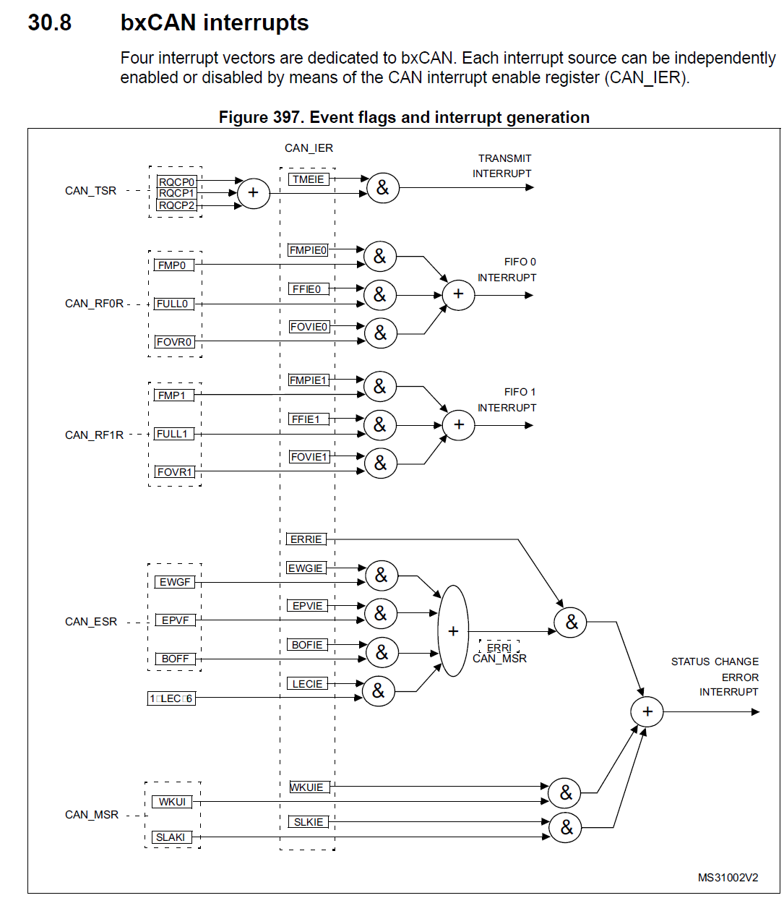
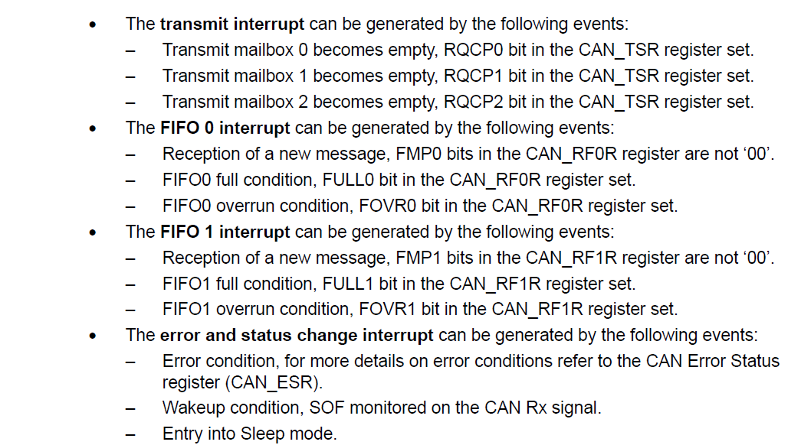
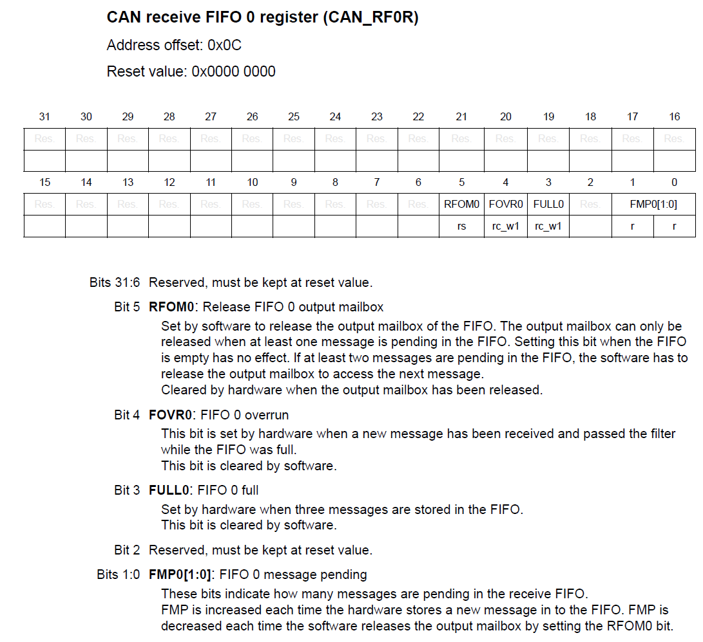
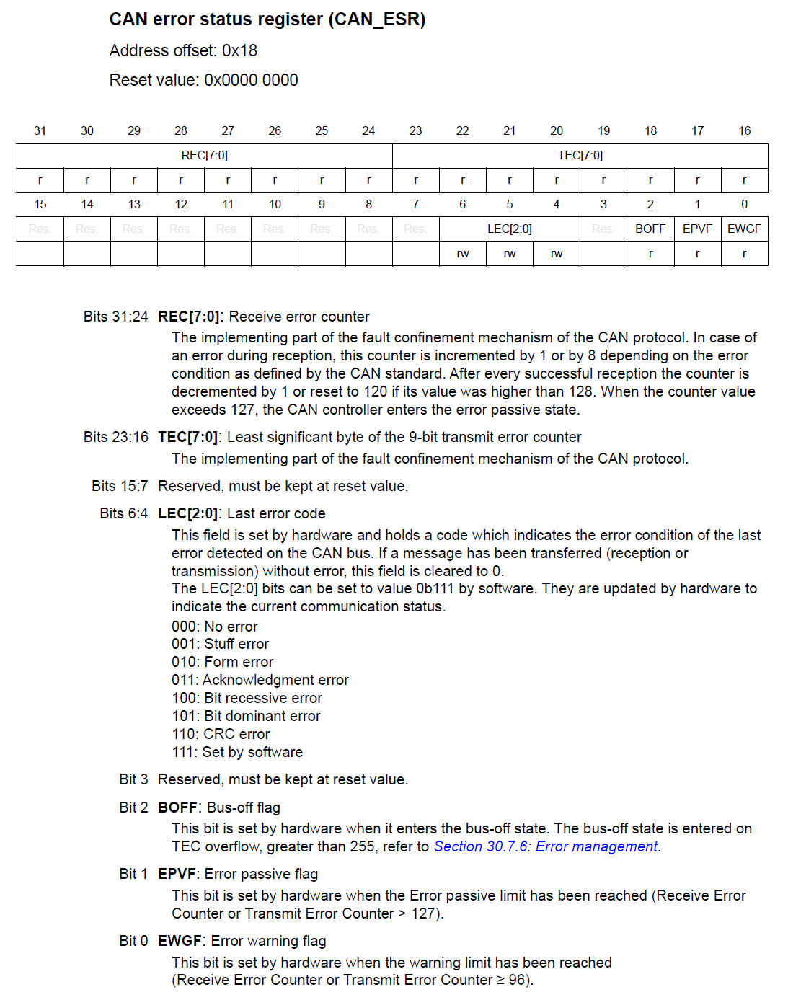
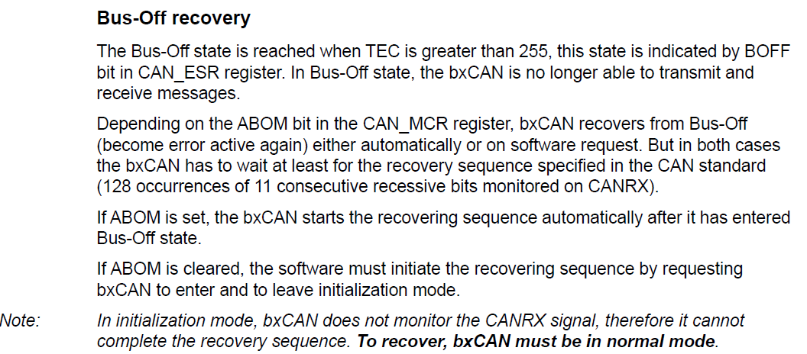

On following ocassions bxCAN issue interrupts:     
     
1. Transmit request completed    
2. Frame is received in Rx FIFO0    
3. Frame is received in Rx FIFO1
4. During CAN status change or Error         

**Four** interrupt vectors (IRQs) are dedicated to _bxCAN1_    
**Four** interrupt vectors (IRQs) are dedicated to _bxCAN2_      


### bxCAN interrupt generation        

Refer to RM page: 1065 figure 397, Event flags and interrupt generation          

Four interrupt vectors are dedicated to bxCAN. Each interrupt source can be independently enabled or disabled by means of the CAN interrupt Enable Register (CAN_IER)      
At figure 397 we can see the Interrupt generation and there are four lines which are going to the NVIC engine of the processor (that means each bxCAN can trigger interrupts on four different IRQs)    
     
      
     
First one is **TRANSMIT INTERRUPT** and if you observe closely you will see the sources or causes (_RQCP0_, _RQCP1_, and _RQCP2_) for this interrupt. RQCP0 stands for **Request Completed** for mailbox 0 and so on. As when Transmit mailbox 0 becomes empty (found in CAN_TSR register set).    

Next is **FIFO 0/1 INTERRUPT** and causes are _FMP0/1_, _FULL0/1_, _FOVR0/1_ and you can find these bits in CAN_RFOR and CAN_RF1R register sets.     
     
      
     
     
      
     
      
     
All the CAN controllers, will have something called _Receive Error Counter_ and _Transmit Error Counter_ which increases whenever there is an error (Transmitter is sending invalid frames or receiver is getting the error frames). When this error counter reaches to some value then according to specification Transmitter/Receiver, whatever involved in the transaction, is considered as Faulty to protect other node on the bus. All those error management will be taken care of by the hardware. However it will be indicated to the application through interrupt.     
     
The **Bus-off** state means node will be connected to the bus, however it will not be transmitting or receiving anything then interrupt would be trigger to the application and now the application should decide, what to do with that Node. So, it can reset that controller and it can resume the normal operation. and when you reset the device, It will go to the initialization mode once again and it will be initialized once again and then it will be move to the normal operation and all the error counters will be reset. Yop can read more about Bus-off recover at **page: 1061**.      
      
         
      

### Interrupt settings     

**Set** the priority for desired interrupts and **Enable** them in `msp.c`      

```c
void HAL_CAN_MspInit(CAN_HandleTypeDef *hcan)
{
  GPIO_InitTypeDef gpio_can;

  __HAL_RCC_CAN1_CLK_ENABLE();
  ...

  HAL_NVIC_SetPriority(CAN1_TX_IRQn, 15, 0);
  HAL_NVIC_SetPriority(CAN1_RX0_IRQn, 15, 0);
  HAL_NVIC_SetPriority(CAN1_RX1_IRQn, 15, 0);
  HAL_NVIC_SetPriority(CAN1_SCE_IRQn, 15, 0);

  HAL_NVIC_EnableIRQ(CAN1_TX_IRQn);
  HAL_NVIC_EnableIRQ(CAN1_RX0_IRQn);
  HAL_NVIC_EnableIRQ(CAN1_RX1_IRQn);
  HAL_NVIC_EnableIRQ(CAN1_SCE_IRQn);
}
```      

Get the IRQHandler names from _startup file_ and implement them in `it.c` and call the Interrupt processing CubeMx API `HAL_CAN_IRQHandler(&hcan1)` for CAN peripheral       

```c
extern CAN_HandleTypeDef hcan1;

void SysTick_Handler (void)
{
  HAL_IncTick();
  HAL_SYSTICK_IRQHandler();
}

void CAN1_TX_IRQHandler(void)
{
  HAL_CAN_IRQHandler(&hcan1);
}

void CAN1_RX0_IRQHandler(void)
{
  HAL_CAN_IRQHandler(&hcan1);
}

void CAN1_RX1_IRQHandler(void)
{
  HAL_CAN_IRQHandler(&hcan1);
}

void CAN1_SCE_IRQHandler(void)
{
  HAL_CAN_IRQHandler(&hcan1);
}
```       

Implement the desired callbacks in your application (i.e. `main_app.c`)        

```c
void HAL_CAN_TxMailbox0CompleteCallback(CAN_HandleTypeDef *hcan){}
void HAL_CAN_TxMailbox1CompleteCallback(CAN_HandleTypeDef *hcan){}
void HAL_CAN_TxMailbox2CompleteCallback(CAN_HandleTypeDef *hcan){}
void HAL_CAN_RxFifo0MsgPendingCallback(CAN_HandleTypeDef *hcan){}
void HAL_CAN_ErrorCallback(CAN_HandleTypeDef *hcan){}
```    

Next activate the interrupts from their Interrupt Enable bits (i.e. TMEIE, FMPIE0, FFIE0 etc.), as shown in Figure 397, in the peripheral side. We have a nice CubeMx API (`HAL_CAN_ActivateNotification()`) to enable those Interrupt bits in the peripheral side. Now call this API right before staring the CAN (`HAL_CAN_Start()`) in the `main()`        
```c
int main(void)
{
  HAL_Init();
  SystemClock_Config_HSE(SYS_CLOCK_FREQ_50_MHZ);
  GPIO_Init();
  UART2_Init();
  CAN1_Init();
  CAN_FilterConfig();

  if (HAL_CAN_ActivateNotification(&hcan1, CAN_IT_TX_MAILBOX_EMPTY | CAN_IT_RX_FIFO0_MSG_PENDING | CAN_IT_BUSOFF) != HAL_OK)
  {
	  Error_handler();
  }

  if (HAL_CAN_Start(&hcan1) != HAL_OK)
  {
	  Error_handler();
  }

  CAN1_Tx();

  while (1);

  return 0;
}
``` 


Following is the complete implementation of Callbacks. Calling `CAN1_Rx()` API will be removed from `main()`, we rather do Rx inside RX callback `HAL_CAN_RxFifo0MsgPendingCallback()`.    
```c
void HAL_CAN_TxMailbox0CompleteCallback(CAN_HandleTypeDef *hcan)
{
  char msg[50];
  sprintf(msg, "Message transmitted:M0\r\n");
  HAL_UART_Transmit(&huart2, (uint8_t*)msg, strlen(msg), HAL_MAX_DELAY);
}

void HAL_CAN_TxMailbox1CompleteCallback(CAN_HandleTypeDef *hcan)
{
  char msg[50];
  sprintf(msg, "Message transmitted:M1\r\n");
  HAL_UART_Transmit(&huart2, (uint8_t*)msg, strlen(msg), HAL_MAX_DELAY);
}

void HAL_CAN_TxMailbox2CompleteCallback(CAN_HandleTypeDef *hcan)
{
  char msg[50];
  sprintf(msg, "Message transmitted:M2\r\n");
  HAL_UART_Transmit(&huart2, (uint8_t*)msg, strlen(msg), HAL_MAX_DELAY);
}

void HAL_CAN_RxFifo0MsgPendingCallback(CAN_HandleTypeDef *hcan)
{
  CAN_RxHeaderTypeDef rx_header;
  uint8_t rcvd_msg[5];

  if (HAL_CAN_GetRxMessage(&hcan1, CAN_RX_FIFO0, &rx_header, rcvd_msg) != HAL_OK)
  {
	Error_handler();
  }

  char msg[50];
  sprintf(msg, "Message received: %s\r\n", rcvd_msg);
  HAL_UART_Transmit(&huart2, (uint8_t*)msg, strlen(msg), HAL_MAX_DELAY);
}

void HAL_CAN_ErrorCallback(CAN_HandleTypeDef *hcan)
{
  char msg[50];
  sprintf(msg, "CAN error detected\r\n");
  HAL_UART_Transmit(&huart2, (uint8_t*)msg, strlen(msg), HAL_MAX_DELAY);
}
```


     


   