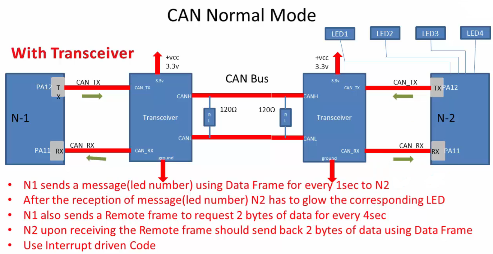
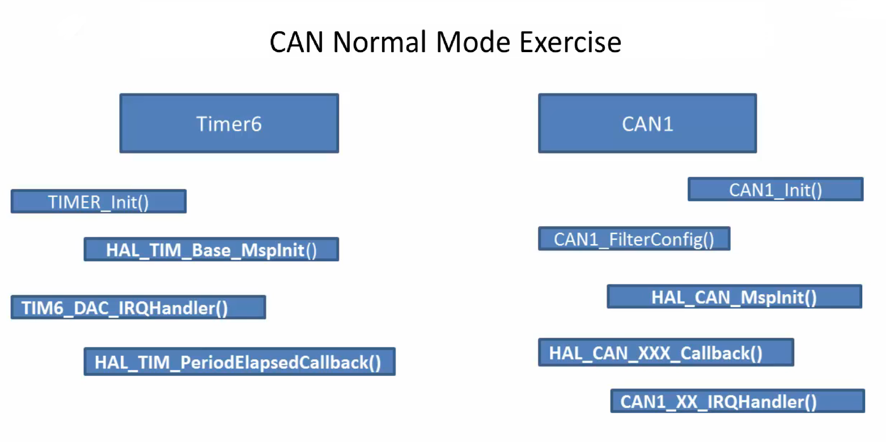
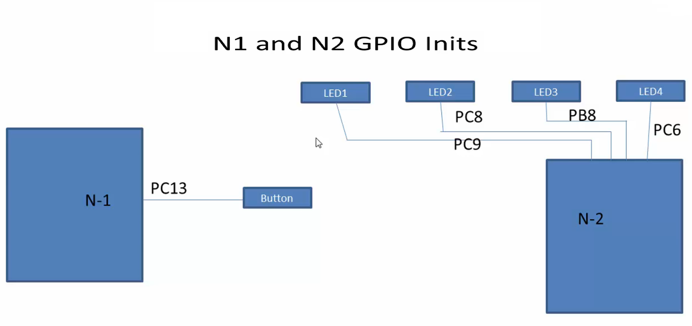
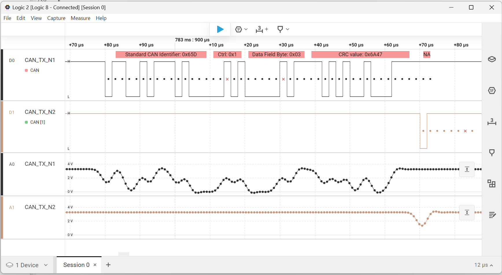
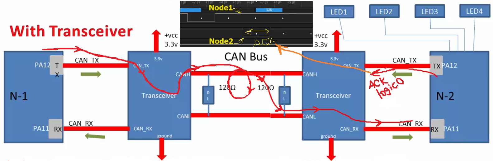

        
      
Connect **N1**'s GND/3.3v to **Transciever1**'s GND/3.3v and **N2**'s GND/3.3v to **Transceiver2**'s GND/3.3v, Similarly **N1**'s Tx/Rx to **Transciever1**'s Tx/Rx and **N2**'s Tx/Rx to **Transceiver2**'s Tx/Rx      
Connect **Transceiver1**'s CANH to **Transceiver2**'s CANH, Similarly connect CANL of both Transceivers.      
        
    
          
     

We will build/run the same code on both MCUs one by one, Here N1 refer to Node1 which is MCU1 (NUCLEO-F446RE) and similarly N2 (Node2) which is another NUCLEO-F446RE i.e. MCU2. Unplug both the boards and Reset N1 and N2, then press button (TIM6 will also activated) on N1 to trigger the transmission.        

We will use Logic analyser to trace the **CAN1_Tx** of _MCU1_ by connecting logic analyser's **Channel0** (Logic analyser's GND to MCU1 GND), Similarly **CAN1_Tx** of _MCU2_ with the logic analyser's **Channel1** (Logic analyser's GND to MCU2 GND). In order to get the successful trace you need to connect the GND properly. In the Logic2 software select both Channels one by one and give the Bit Rate as _500000_ i.e. 500Kbps.   
     
        

N2 will make the bus state as dominant (logic 0) exactly at the ACK position of the frame indicating transmitter that reception is successful.  
     
When you transmit a message from N1, it gets transmitted through CAN1_Tx (from N1's PA12 pin) to transciever1's CAN_Tx, all the way through bus to other transciever's CANH to CANL and reaches N2's CAN_Rx. When Node2 started receiving that packet, which is coming over CAN_RX it also calculates the CRC of that packet. And when the CRC from the Node 1 reaches Node 2, it compares the calculated CRC with the received CRC from Node 1. If the CRC matches then N2 concludes that frame or the message which is being received is correct. And not only the CRC, it also checks for other errors like CAN bit errors or any other protocol violation, automatically. If everything is fine then exactly at that ACK position it pushes the dominant bit over CAN TX as shown below. That's the reason you see a logical 0 happening exactly at the ACK field.     

                        
     

     

   