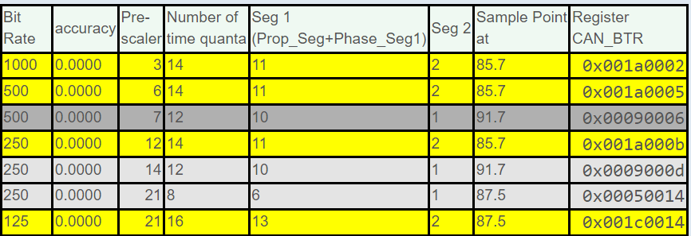

In previous project, we tested operation of CAN Normal Mode by using two Nodes at 500 kbps of bit rate. In this project we will increase that bitrate achieve up to 1 Mbit/sec.     
     
> [>IMPORTANT]    
> Remember, in the previous project we tested the Nodes by placing them very close to each other around 10 inches, However if you increase the distance like 1 meter, 2 meter, or 10 meters between the Nodes then the higher bit rates may not work. Hence you have to play with the numbers related to CAN bit timings like Prescaler, SyncJumpWidth TimeSeg1, and TimeSeg2.     
     
Goto [bittiming can wiki](http://www.bittiming.can-wiki.info) and select ST Microelectronics bxCAN, _Clock Rate_ as 25 (25MHz), Sample-Point as 87.5, and SJW as 1 and click _Request Table_ button. Generated table show the maximum CAN you can achieve is 500Kbps. Lets increase the Clock speed to 84MHz, thereby you can get 42MHz on APB1 Bus where CAN is hanging also change this in the code with macro we already define `SYS_CLOCK_FREQ_84_MHZ`. Now go back to [bittiming can wiki](http://www.bittiming.can-wiki.info) and recalculate by providing Clock Rate as 42 and and click _Request Table_ button to generate the table.    

     

```c
void CAN1_Init(void)
{
  hcan1.Instance = CAN1;
  ...

  // Settings related to CAN bit timings
  hcan1.Init.Prescaler = 3;
  hcan1.Init.SyncJumpWidth = CAN_SJW_1TQ;    // always 1 quanta
  hcan1.Init.TimeSeg1 = CAN_BS1_11TQ;
  hcan1.Init.TimeSeg2 = CAN_BS2_2TQ;

  if (HAL_CAN_Init(&hcan1) != HAL_OK)
  {
	Error_handler();
  }
}
```    

> [!IMPORTANT]    
> Dont forget to adjust Bit Rate as 1000000 (1MBit/sec) in Logic analyser's CAN settings, both Node1 and Node2.     

You can increase the distance between nodes to 1 meter using _twisted pair cable_ and see if you can achieve the frame transmission with 1MBit/s without ACK error. If there is any error reduce the bitrate and repeat the experiment.                


     


     


   