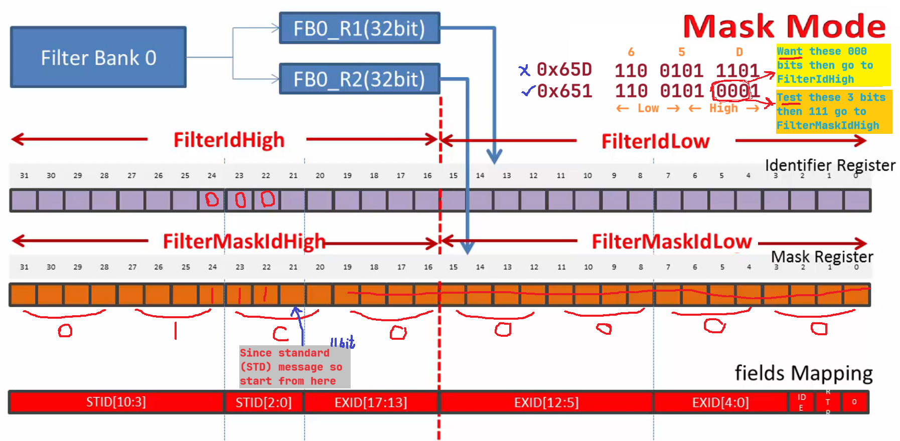
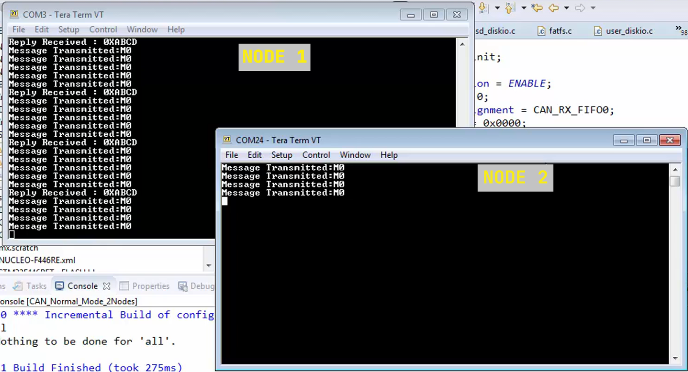

In this project we will change the acceptance filtering to filter out some messages as in previous CAN projects we kept the acceptance filtering (`FilterMaskIdHigh`, and `FilterMaskIdLow`) and their corresponding `FilterIdHigh`, and `FilterIdLow` all **0x0000** as we were interested in receiving all the messages however here we will change the values to these register to get only desired message and discard others.     
     
> [!NOTE]      
> A quick reminder, to filter out bits you want in a message make them 1s in FilterMaskId High and Low registers (as these are test bits same when doing & operation). And value you want either 1s or 0s put them in the FilterId High and Low registers.      

Node1 will send couple of messages 0x65D and 0x651, Whereas we will make Node2 discard 0x65D as we are only interested in **0x651**      
    
        
     
```c
void CAN_FilterConfig(void)
{
  CAN_FilterTypeDef can1_filter;

  can1_filter.FilterActivation = ENABLE;
  can1_filter.FilterBank = 0;
  can1_filter.FilterFIFOAssignment = CAN_RX_FIFO0;

  /*
   * Only Accept/filter out 0x651 message in Mask mode
   */
  can1_filter.FilterIdHigh = 0x0000;
  can1_filter.FilterIdLow = 0x0000;
  can1_filter.FilterMaskIdHigh = 0x01C0;
  can1_filter.FilterMaskIdLow = 0x0000;
  can1_filter.FilterMode = CAN_FILTERMODE_IDMASK;

  /*
   * by default 32-bit and R1(ID), R2(MASK) register will each considered as 32 bit
   * if 16-bit filter scale selected then R1(ID), R1(MASK), R2(ID), and R2(MASK) registers
   * each 16 bit wide
   *
   * consult RM page: 1057, Figure 391. Filter bank scale configuration - Register organization
   */
  can1_filter.FilterScale = CAN_FILTERSCALE_32BIT;

  if (HAL_CAN_ConfigFilter(&hcan1, &can1_filter) != HAL_OK)
  {
	Error_handler();
  }
}
```     

       

These frames will be discarded in the Rx stage only and won't come to the FIFO at all as it will  minimise the overhead of the processor as the processor has to be interrupted for every message  which application is not interested.


     


     


   